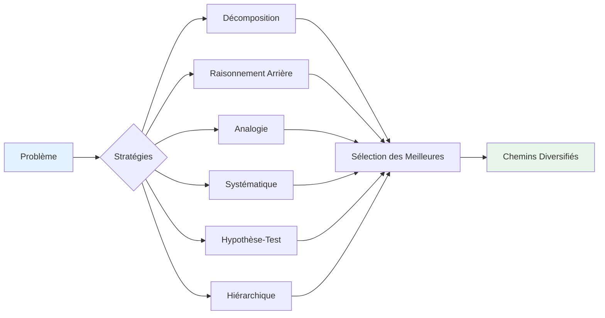
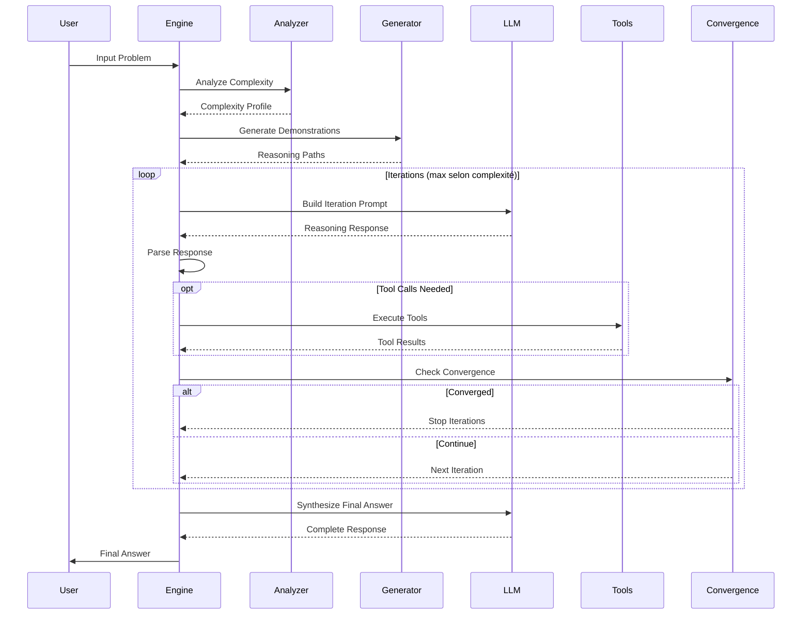
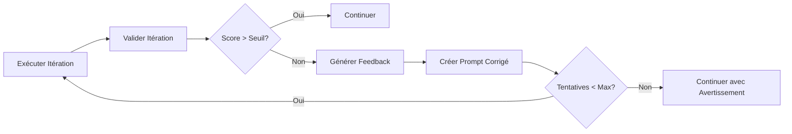
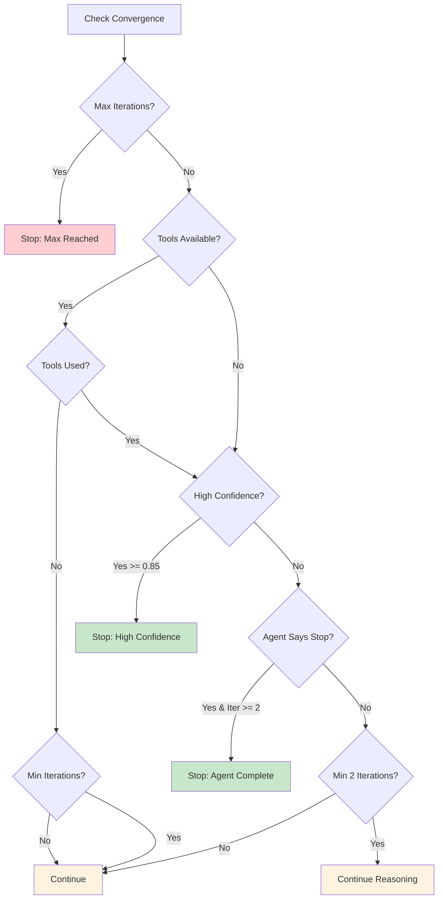
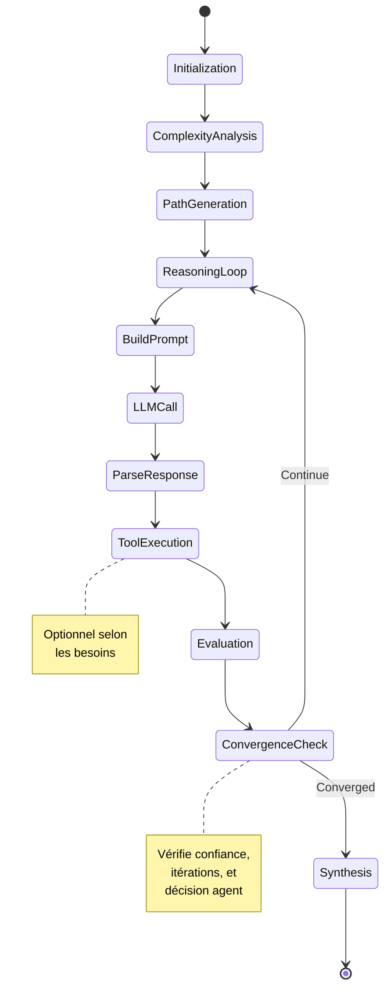

# Chain of Thought Adaptatif - Documentation Complète

## 🧠 Vue d'ensemble

Le système de **Chain of Thought (CoT) Adaptatif** d'UXMCP est un moteur de raisonnement avancé inspiré par les recherches sur Auto-CoT (Automatic Chain of Thought) qui permet aux agents IA de résoudre des problèmes complexes de manière structurée et itérative.

### ✨ Nouveauté : Auto-Validation et Correction

Le système intègre maintenant une **boucle de validation automatique** à chaque étape de raisonnement. Chaque itération est évaluée sur sa pertinence, son progrès et son exactitude. Si une étape n'est pas satisfaisante, le système la corrige automatiquement avant de continuer.

## 📊 Architecture du Système


## 🔍 Composants Principaux

### 1. Analyseur de Complexité (`ComplexityAnalyzer`)

L'analyseur examine le problème et détermine automatiquement sa complexité selon plusieurs dimensions :

#### Classification des Problèmes

| Cluster | Description | Caractéristiques | Stratégie |
|---------|-------------|------------------|-----------|
| **SIMPLE** | Questions directes | Recherche simple, fait unique | Réponse directe |
| **ARITHMETIC** | Calculs mathématiques | Nombres, opérations | Calcul étape par étape |
| **LOGICAL** | Raisonnement logique | Si/alors, implications | Décomposition logique |
| **MULTI_STEP** | Problèmes complexes | Entités multiples, contraintes | Décomposition hiérarchique |
| **CREATIVE** | Tâches créatives | Génération, imagination | Exploration divergente |
| **ANALYTICAL** | Analyse de données | Comparaison, évaluation | Analyse systématique |

#### Extraction de Features

```python
features = {
    'length': len(problem),                    # Longueur du texte
    'sentence_count': nombre_de_phrases,       # Complexité structurelle
    'has_math': présence_math,                # Indicateurs mathématiques
    'has_logical_operators': opérateurs_logiques,  # Si, alors, tous, etc.
    'entity_count': nombre_entités,           # Complexité des données
    'has_nested_conditions': conditions_imbriquées,  # Logique complexe
    'requires_calculation': besoin_calcul,    # Opérations nécessaires
    'has_constraints': contraintes_présentes  # Restrictions à respecter
}
```

### 2. Générateur de Démonstrations (`DemonstrationGenerator`)

Génère plusieurs chemins de raisonnement diversifiés pour éviter la propagation d'erreurs :

#### Stratégies de Raisonnement



#### Templates de Raisonnement

1. **Décomposition** : Diviser le problème en sous-parties
2. **Raisonnement Arrière** : Partir du résultat souhaité
3. **Analogie** : Trouver des problèmes similaires
4. **Systématique** : Approche méthodique étape par étape
5. **Hypothèse-Test** : Former et tester des hypothèses
6. **Hiérarchique** : Organisation en niveaux d'abstraction

### 3. Moteur Adaptatif (`AdaptiveChainOfThought`)

Le cœur du système qui orchestre le processus de raisonnement :

#### Flow d'Exécution



#### Structure d'une Itération

```python
@dataclass
class ReasoningIteration:
    iteration_number: int          # Numéro de l'itération
    reasoning_type: str           # Type de stratégie utilisée
    thought: str                  # Réflexion pour cette étape
    tool_calls: List[ToolCall]   # Outils appelés
    tool_results: List[ToolResult]  # Résultats des outils
    evaluation: str               # Auto-évaluation
    confidence: float            # Niveau de confiance (0-1)
    should_continue: bool        # Continuer ou arrêter
    knowledge_gathered: str      # Connaissances acquises
    # Nouveaux champs de validation
    is_valid: bool               # L'itération est-elle valide?
    validation_feedback: str     # Feedback de validation
    correction_attempts: int     # Nombre de tentatives de correction
    relevance_score: float       # Score de pertinence (0-1)
    progress_score: float        # Score de progrès (0-1)
    correctness_score: float     # Score d'exactitude (0-1)
```

### 4. Système de Validation Automatique (`IterationValidator`)

Le système de validation évalue chaque étape de raisonnement selon 5 critères :

#### Critères de Validation

| Critère | Description | Score |
|---------|-------------|-------|
| **Pertinence** | L'étape adresse-t-elle directement le problème? | 0.0 - 1.0 |
| **Progrès** | Avons-nous appris quelque chose de nouveau? | 0.0 - 1.0 |
| **Exactitude** | Le raisonnement est-il logiquement correct? | 0.0 - 1.0 |
| **Efficacité** | L'approche est-elle optimale? | Évalué qualitativement |
| **Complétude** | Tous les aspects importants sont-ils couverts? | Évalué qualitativement |

#### Processus de Validation et Correction



#### Mécanisme de Correction

Quand une itération échoue la validation :
1. **Feedback détaillé** : Identification précise des problèmes
2. **Instructions de correction** : Approche suggérée pour améliorer
3. **Nouvelle tentative** : Maximum 2 corrections par itération
4. **Traçabilité** : Tous les scores et feedbacks sont conservés

### 5. Détecteur de Convergence (`ConvergenceDetector`)

Détermine quand le raisonnement a atteint une solution satisfaisante :

#### Critères de Convergence



## 🔧 Configuration et Paramètres

### Paramètres de Complexité

| Complexité | Itérations Base | Max Itérations | Facteur Diversité |
|------------|-----------------|----------------|-------------------|
| SIMPLE | 2 | 3 | 1.0 |
| ARITHMETIC | 4 | 5 | 1.0 |
| LOGICAL | 5 | 7 | 1.5 |
| MULTI_STEP | 6 | 10 | 2.0 |
| CREATIVE | 4 | 6 | 2.5 |
| ANALYTICAL | 5 | 8 | 1.8 |

### Ajustements Dynamiques

Le système ajuste automatiquement les paramètres selon :
- **Nombre d'entités** : +1 itération par entité au-delà de 2
- **Conditions imbriquées** : +2 itérations
- **Longueur du problème** : +2 itérations si > 200 caractères
- **Présence de calculs** : +1 itération si nombres présents

## 🛠️ Intégration avec les Outils MCP

### Support des Outils

Le système intègre transparemment les outils MCP :

```python
async def cot_tool_executor(tool_name: str, arguments: Dict) -> Any:
    # Outils de mémoire
    if tool_name in ["memory_search", "memory_store", "memory_analyze"]:
        return await memory_tool_handler(tool_name, arguments)
    
    # Outils MCP externes
    if tool_name.startswith("mcp_"):
        return await external_mcp_handler(tool_name, arguments)
    
    # Services MCP locaux
    return await mcp_manager.execute_tool(tool_name, arguments)
```

### Format des Appels d'Outils

```
TOOL_CALLS: 
memory_search(query="information sur le client X")
calculate_metrics(data="[1,2,3,4,5]", operation="mean")
web_search(query="dernières nouvelles IA 2024")
```

## 📈 Métriques et Performance

### Indicateurs de Performance

| Métrique | Description | Valeur Optimale |
|----------|-------------|-----------------|
| **Convergence Rate** | % de problèmes résolus avant max iterations | > 85% |
| **Tool Efficiency** | Ratio outils utiles / outils appelés | > 0.8 |
| **Confidence Growth** | Augmentation moyenne par itération | > 0.15 |
| **Answer Quality** | Évaluation de la réponse finale | > 0.9 |
| **Validation Success** | % d'itérations valides au premier essai | > 70% |
| **Correction Efficiency** | % de corrections réussies | > 90% |
| **Average Relevance** | Score moyen de pertinence | > 0.75 |

### Optimisations

1. **Cache de Démonstrations** : Réutilisation pour problèmes similaires
2. **Parallélisation d'Outils** : Exécution simultanée quand possible
3. **Early Stopping** : Arrêt dès haute confiance atteinte
4. **Context Pruning** : Suppression des informations non pertinentes

## 💡 Exemples d'Utilisation

### Exemple avec Validation et Correction

```python
Input: "Analyse les ventes Q1 et trouve des améliorations"

Iteration 1:
  Thought: "Je vais d'abord parler de l'histoire de l'entreprise..."
  Validation: INVALID ❌
  - Relevance: 0.2 (Hors sujet)
  - Progress: 0.1 (Pas de progrès vers la solution)
  Feedback: "Focus sur les données de ventes Q1, pas l'historique"
  
Iteration 1 (Correction 1):
  Thought: "Je dois récupérer les données de ventes Q1"
  Tool Calls: get_sales_data(quarter="Q1")
  Validation: VALID ✅
  - Relevance: 0.9
  - Progress: 0.8
  Knowledge: "Ventes Q1: 150k€, 3 produits principaux..."

Iteration 2:
  Thought: "Analysons les tendances et points faibles"
  Tool Calls: analyze_trends(data=q1_data)
  Validation: VALID ✅
  Final Answer: "Analyse complète avec 5 recommandations..."
```

### Exemple 1 : Question Simple

```python
Input: "Quelle est la capitale de la France ?"

Complexity: SIMPLE
Max Iterations: 3
Strategy: direct

Iteration 1:
  Thought: "Question factuelle simple sur la géographie"
  Tool Calls: memory_search(query="capitale France")
  Confidence: 0.95
  Should Continue: false

Final Answer: "La capitale de la France est Paris."
```

### Exemple 2 : Problème Multi-Étapes

```python
Input: "Compare les ventes Q1 et Q2, calcule la croissance et suggère des améliorations"

Complexity: MULTI_STEP
Max Iterations: 10
Strategy: hierarchical_decomposition

Iteration 1:
  Thought: "Décomposer en 3 sous-tâches : récupération données, calcul, suggestions"
  Tool Calls: get_sales_data(quarter="Q1"), get_sales_data(quarter="Q2")
  
Iteration 2:
  Thought: "Calculer la croissance avec les données obtenues"
  Tool Calls: calculate_growth(q1=150000, q2=175000)
  
Iteration 3:
  Thought: "Analyser les tendances pour suggestions"
  Tool Calls: analyze_trends(data={...})
  
Final Answer: "Analyse complète avec croissance de 16.7% et 5 recommandations..."
```

## 🔄 États et Transitions



## 🎯 Bonnes Pratiques

### Pour les Développeurs

1. **Configuration d'Agent**
   ```python
   agent.reasoning_strategy = "chain-of-thought"  # Active le CoT
   agent.max_iterations = 10  # Limite personnalisée
   ```

2. **Outils Optimisés**
   - Noms descriptifs pour meilleure sélection
   - Descriptions claires des paramètres
   - Retours structurés en JSON

3. **Gestion de la Mémoire**
   - Activer pour contextes longs
   - Limiter à l'information pertinente

### Pour les Utilisateurs

1. **Formulation des Questions**
   - Être spécifique sur les attentes
   - Inclure les contraintes importantes
   - Mentionner le format souhaité

2. **Sélection d'Agent**
   - Agents spécialisés pour domaines spécifiques
   - CoT pour problèmes complexes
   - Standard pour questions simples

## 📊 Monitoring et Débogage

### Logs Détaillés

Le système génère des logs à chaque étape :

```json
{
  "level": "INFO",
  "message": "CoT completed",
  "iterations": 5,
  "complexity": "MULTI_STEP",
  "convergence_reason": "High confidence with tool results",
  "tool_calls": ["memory_search", "calculate_metrics"],
  "confidence_progression": [0.3, 0.45, 0.6, 0.75, 0.92]
}
```

### Métriques en Temps Réel

- Nombre d'itérations par requête
- Temps moyen par itération
- Taux d'utilisation des outils
- Distribution des types de complexité

## 🚀 Évolutions Futures

1. **Apprentissage Adaptatif**
   - Ajustement automatique des seuils de validation
   - Mémorisation des stratégies efficaces
   - Personnalisation des critères par type de problème

2. **Parallélisation Avancée**
   - Exploration simultanée de chemins
   - Validation parallèle de multiples approches
   - Fusion des résultats parallèles

3. **Meta-Raisonnement**
   - Réflexion sur le processus de raisonnement
   - Auto-amélioration continue
   - Apprentissage des patterns de correction

4. **Validation Contextuelle**
   - Critères adaptatifs selon le domaine
   - Validation par pairs (multi-agents)
   - Métriques personnalisées par utilisateur

## 📚 Références

- **Auto-CoT**: [Zhang et al., 2022] - Automatic Chain of Thought Prompting
- **Chain-of-Thought**: [Wei et al., 2022] - Emergent Abilities of Large Language Models
- **Tool-Augmented LLMs**: [Schick et al., 2023] - Toolformer

---

<div align="center">

**Le Chain of Thought Adaptatif d'UXMCP** - Raisonnement Intelligent et Évolutif

</div>