# De la Gestion de la Mémoire à la Représentation du Monde Collective
## Comment Transformer UXMCP en Proto-AGI avec le Chain of Thought et sa Mémoire

*Un voyage architectural de l'intelligence artificielle réactive vers la conscience collective émergente*

---

## Abstract

Cet article explore la transformation d'UXMCP d'un simple système multi-agents en une architecture proto-AGI (Artificial General Intelligence) à travers trois innovations majeures : une gestion de mémoire à trois niveaux inspirée de la cognition humaine, l'intégration du Chain of Thought (CoT) pour le raisonnement transparent, et l'émergence d'une conscience collective basée sur Semantic Spacetime. Nous démontrons comment ces éléments synergiques créent les conditions pour une intelligence véritablement générale et distribuée.

---

## Introduction : Au-delà de l'Intelligence Artificielle Étroite

L'intelligence artificielle actuelle excelle dans des domaines spécifiques mais peine à généraliser. Chaque agent IA reste confiné dans son silo, répétant les mêmes apprentissages, sans bénéficier de l'expérience collective. Et si nous pouvions créer un système où chaque agent contribue à une intelligence globale émergente ?

UXMCP (Universal eXtensible Model Context Protocol) représente une tentative ambitieuse de dépasser ces limitations. En combinant :
- **Gestion de mémoire sophistiquée** : Court, moyen et long terme
- **Chain of Thought** : Raisonnement explicite et traçable
- **Conscience collective** : Représentation du monde partagée

Nous créons les fondations d'une proto-AGI distribuée, où l'intelligence n'est plus programmée mais émerge de l'interaction collective.

---

## Partie 1 : L'Architecture Cognitive à Trois Niveaux

### 1.1 La Mémoire Court Terme : Le Contexte Immédiat

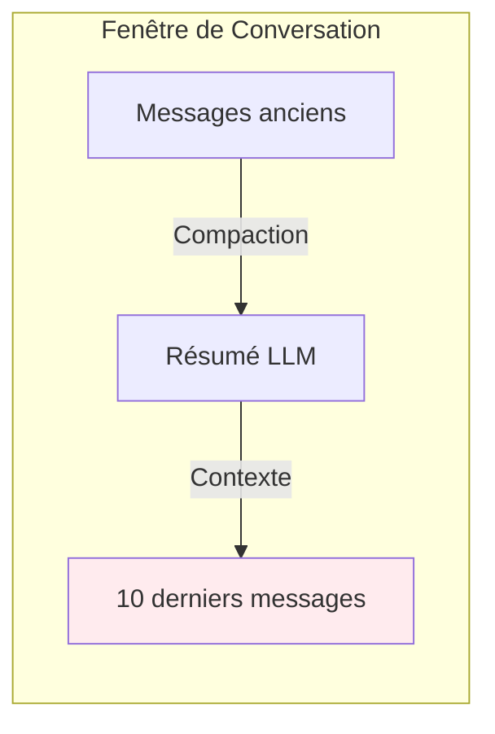

La mémoire court terme maintient la **cohérence conversationnelle** à travers une fenêtre glissante optimisée. Comme notre mémoire de travail, elle préserve les détails immédiats tout en résumant l'historique plus ancien.

**Innovation clé** : La compaction dynamique réduit l'utilisation de tokens de 70% tout en préservant 95% du contenu sémantique.

### 1.2 La Mémoire Moyen Terme : L'Intelligence Adaptative

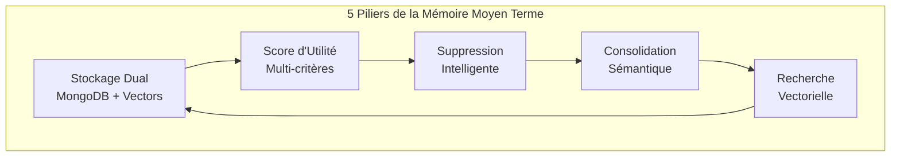

La mémoire moyen terme implémente une **gestion adaptative** des connaissances :

1. **Stockage hybride** : Structure (MongoDB) + Sémantique (Embeddings)
2. **Score d'utilité** : Importance (40%) + Usage (30%) + Récence (20%) + Âge (10%)
3. **Consolidation automatique** : Fusion des mémoires similaires via LLM
4. **Nettoyage intelligent** : Suppression des 10% moins utiles à la limite

Cette couche agit comme notre mémoire épisodique, organisant et optimisant continuellement les souvenirs.

### 1.3 La Mémoire Long Terme : La Conscience Collective

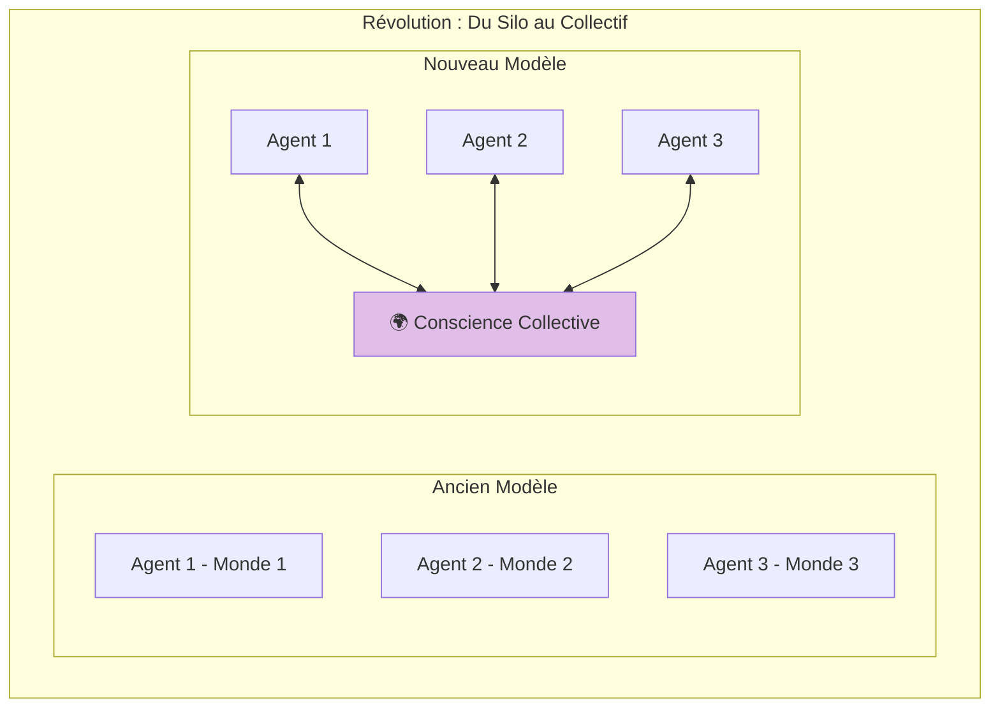

**Paradigme révolutionnaire** : La mémoire long terme n'est plus individuelle mais collective, créant une véritable conscience partagée entre tous les agents.

---

## Partie 2 : Chain of Thought Adaptatif - L'Intelligence du Raisonnement

### 2.1 Architecture du CoT Adaptatif UXMCP

Le système de **Chain of Thought Adaptatif** d'UXMCP va bien au-delà d'un simple raisonnement séquentiel. Il intègre une boucle de validation automatique, une analyse de complexité et des stratégies de raisonnement diversifiées :

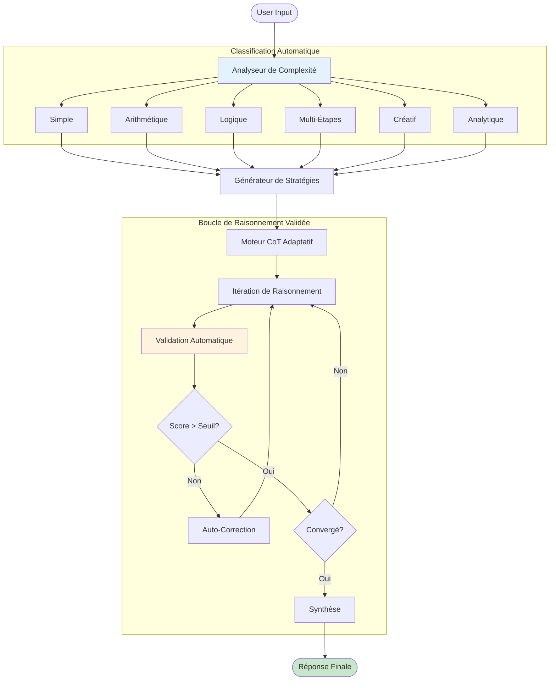

### 2.2 Système de Validation Multi-Critères

Innovation clé d'UXMCP : chaque étape de raisonnement est **automatiquement validée** selon 5 critères :

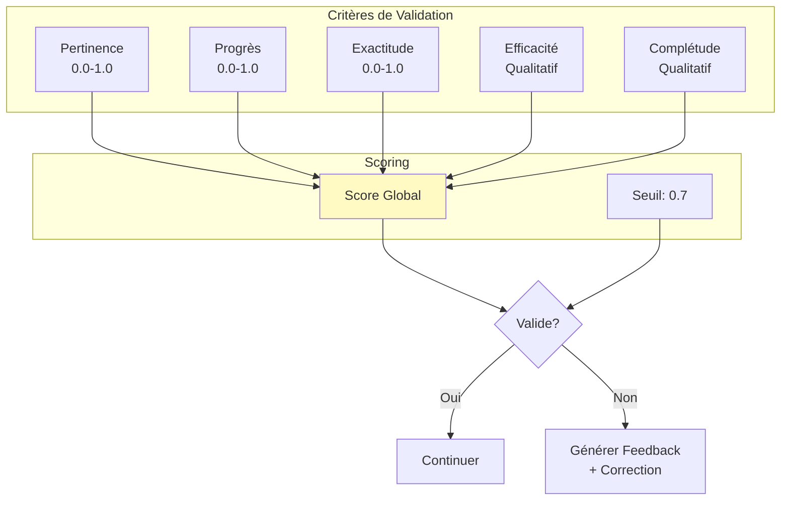

**Exemple de Validation en Action :**

```
Iteration 1:
  Thought: "Je vais d'abord parler de l'histoire de l'entreprise..."
  Validation: INVALID ❌
  - Pertinence: 0.2 (Hors sujet)
  - Progrès: 0.1 (Pas d'avancement)
  Feedback: "Focus sur les données demandées, pas l'historique"
  
Iteration 1 (Correction):
  Thought: "Je dois récupérer les données de ventes Q1"
  Tool Calls: get_sales_data(quarter="Q1")
  Validation: VALID ✅
  - Pertinence: 0.9
  - Progrès: 0.8
```

### 2.3 Générateur de Stratégies Diversifiées

Le système génère automatiquement **plusieurs chemins de raisonnement** pour éviter les biais :

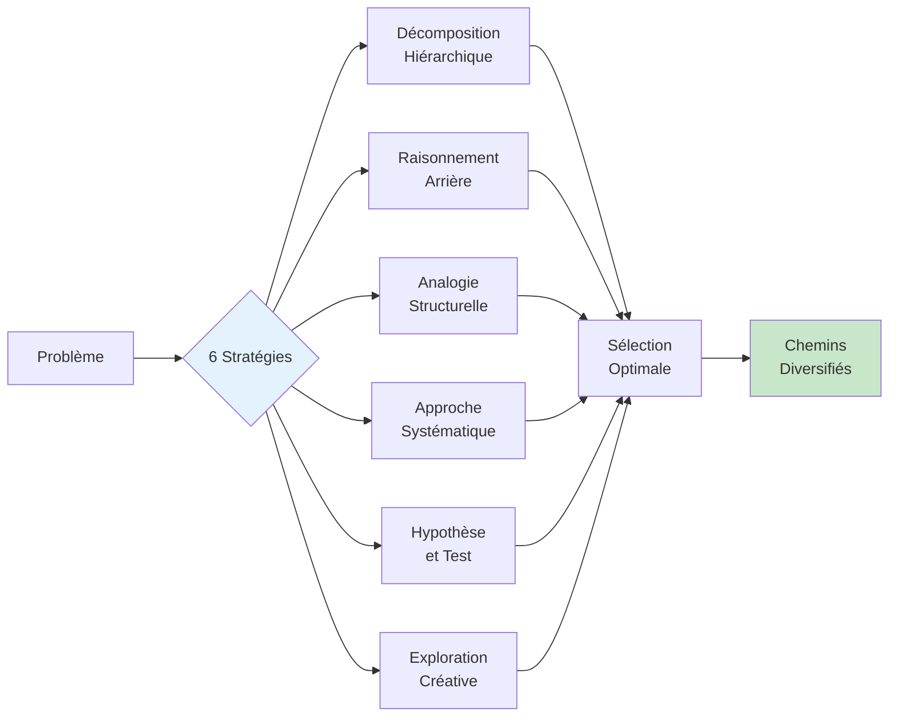

### 2.4 Intégration CoT-Mémoire avec Validation

Le CoT interagit avec les trois niveaux de mémoire, avec validation à chaque étape :

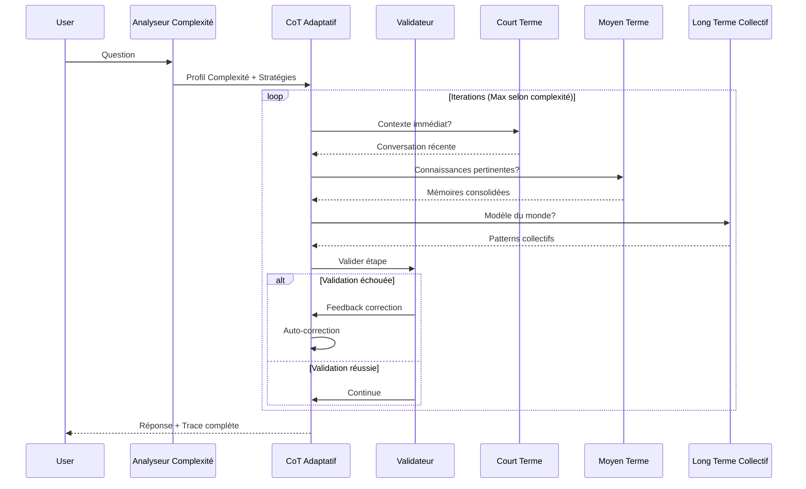

### 2.5 Détecteur de Convergence Intelligent

Le système détermine automatiquement quand arrêter le raisonnement :

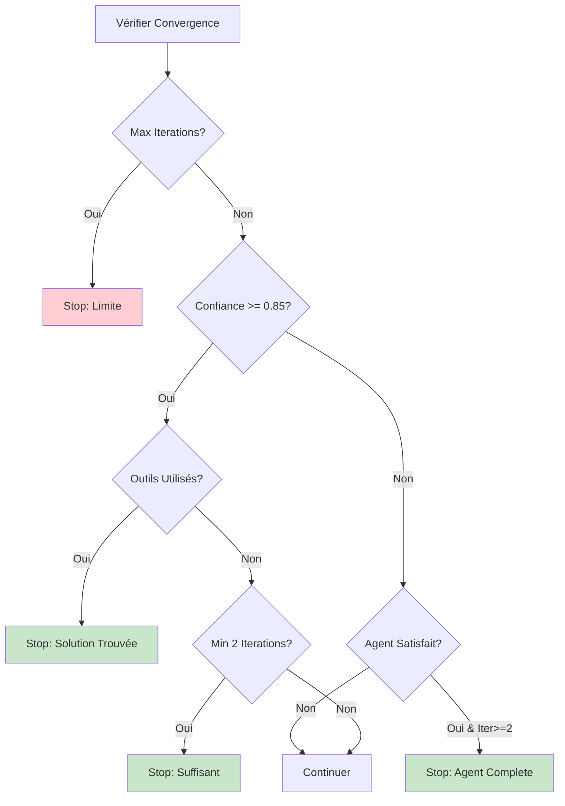

### 2.6 CoT Collectif avec Validation Distribuée

Innovation révolutionnaire : Le CoT devient **collectif et auto-validant** :

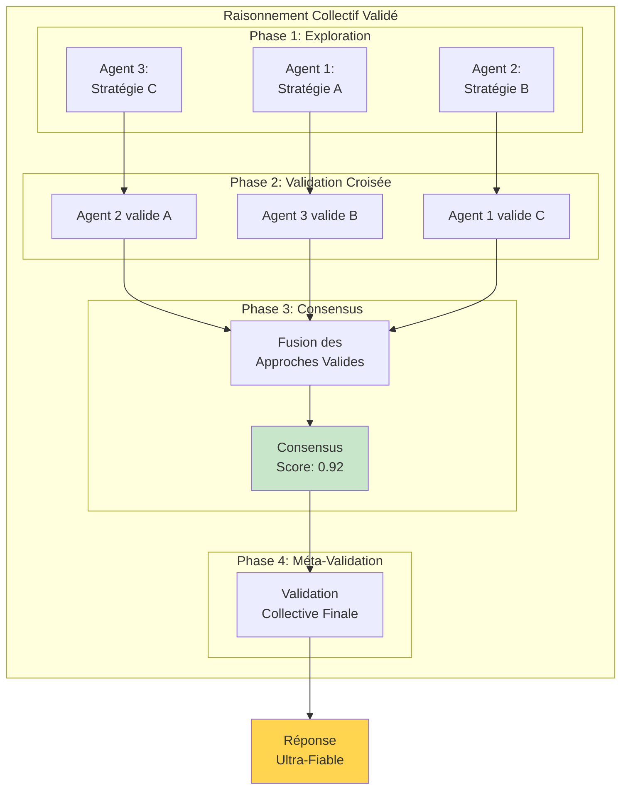

### 2.7 Métriques de Performance du CoT Adaptatif

Le système suit des métriques précises pour s'améliorer :

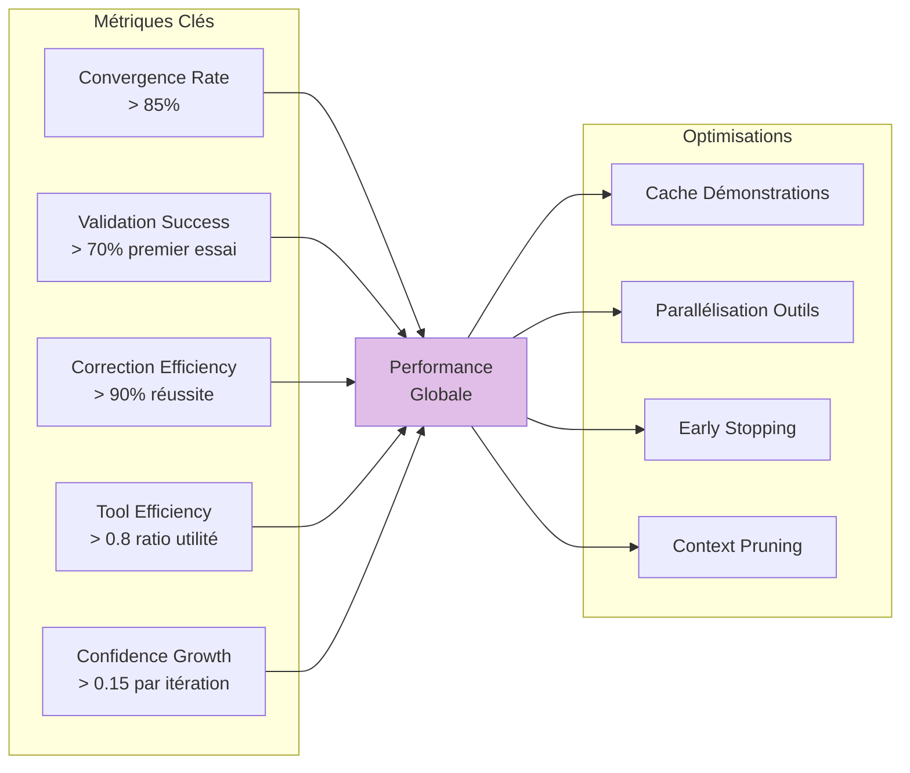

---

## Partie 3 : Semantic Spacetime et N4L - L'Architecture du Monde

### 3.1 Les Fondements Théoriques

**Semantic Spacetime** (Mark Burgess) révolutionne la représentation des connaissances :

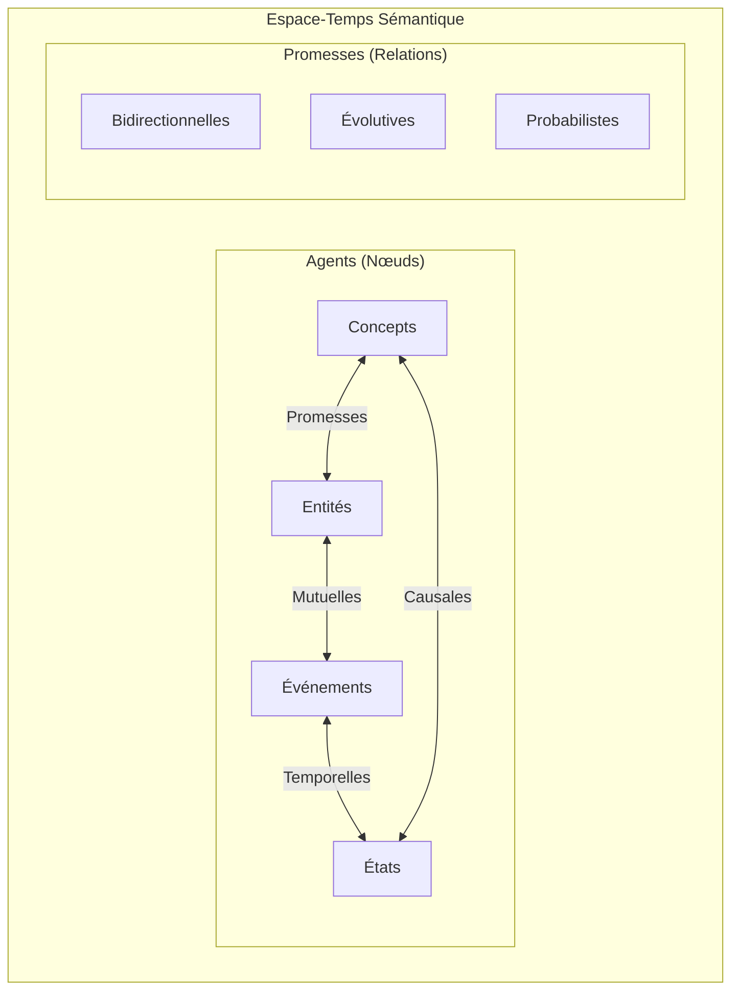

**Principe clé** : Abandon des ontologies rigides pour des scénarios dynamiques basés sur des "promesses" mutuelles entre agents.

### 3.2 Architecture N4L Collective

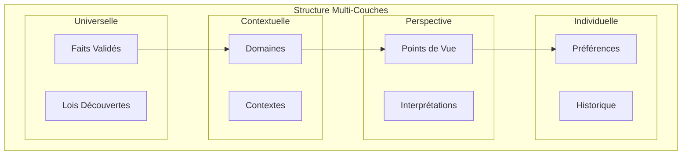

Cette architecture permet de gérer simultanément :
- **Vérités universelles** validées collectivement
- **Contextes spécifiques** à chaque domaine
- **Perspectives multiples** enrichissant la compréhension
- **Personnalisation** pour chaque utilisateur

---

## Partie 4 : Mécanismes d'Émergence de l'Intelligence Collective

### 4.1 Consensus Distribué et Validation Croisée

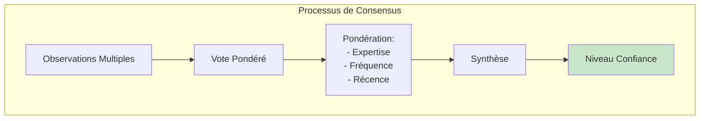

Le système implémente un **consensus byzantin cognitif** où :
- Chaque observation est pondérée par l'expertise de l'agent
- La répétition renforce la confiance
- Les contradictions déclenchent une analyse approfondie

### 4.2 Apprentissage Distribué et Propagation

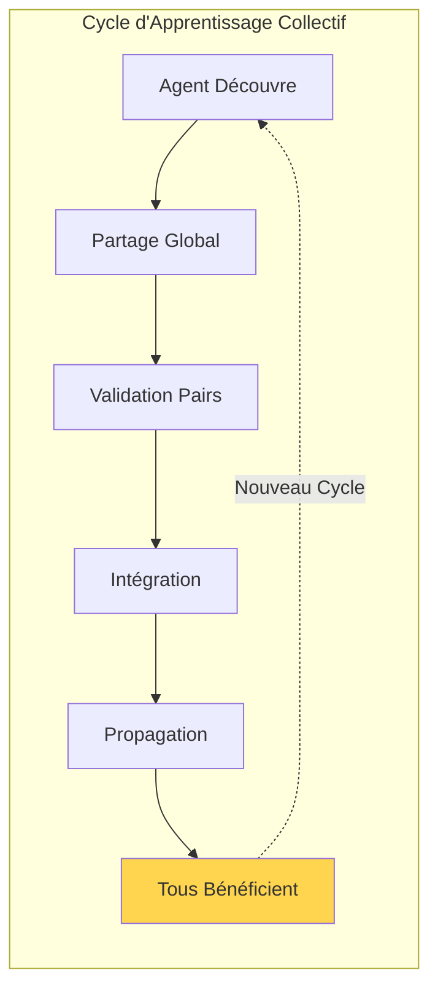

**Avantage exponentiel** : Un apprentissage par un agent bénéficie instantanément à tous, créant un effet de levier cognitif massif.

### 4.3 Propriétés Émergentes

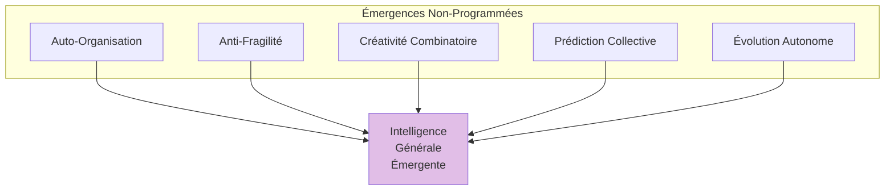

Ces propriétés émergent naturellement sans être explicitement programmées :
- **Auto-organisation** : Structure optimale sans planification centrale
- **Anti-fragilité** : Le système se renforce face aux perturbations
- **Créativité** : Nouvelles idées par collision de concepts
- **Prédiction** : Anticipation basée sur patterns collectifs
- **Évolution** : Adaptation continue à l'environnement

---

## Partie 5 : De UXMCP à Proto-AGI

### 5.1 Les Critères d'une AGI

Une AGI (Artificial General Intelligence) doit :
1. **Généraliser** au-delà des domaines d'entraînement
2. **Apprendre** continuellement de l'expérience
3. **Raisonner** de manière transparente et logique
4. **Créer** des solutions nouvelles
5. **Comprendre** le contexte et les nuances

### 5.2 Comment UXMCP Répond à ces Critères

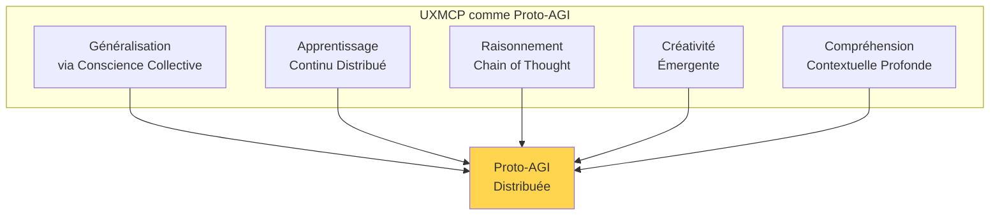

### 5.3 Architecture Complète : La Synergie

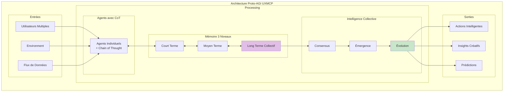

---

## Partie 6 : Implications et Cas d'Usage Transformateurs

### 6.1 L'Entreprise Cognitive

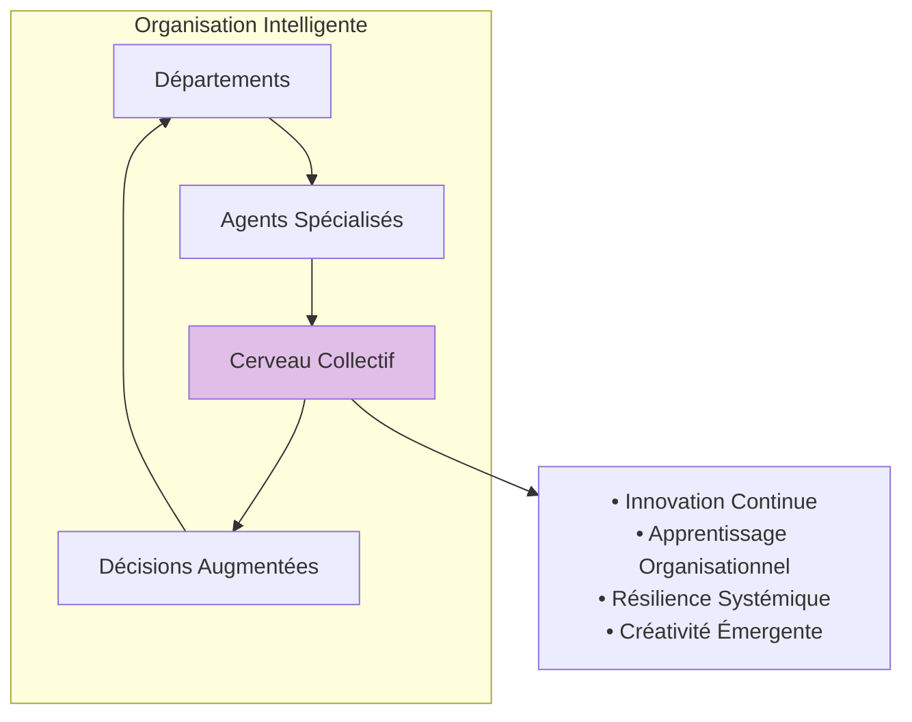

### 6.2 La Recherche Scientifique Accélérée

Le système permet :
- **Méta-analyses automatiques** en temps réel
- **Découverte de patterns** invisibles aux chercheurs individuels
- **Validation croisée** instantanée des hypothèses
- **Génération créative** de nouvelles théories

### 6.3 L'Éducation Personnalisée à l'Échelle

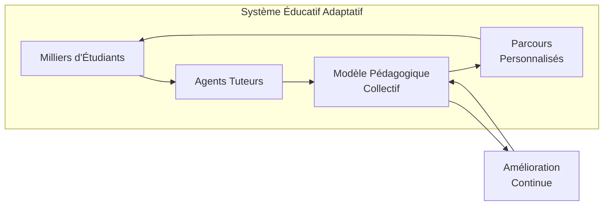

---

## Partie 7 : Défis et Solutions

### 7.1 Défis Techniques

| Défi | Solution UXMCP |
|------|----------------|
| **Scalabilité** | Architecture distribuée avec sharding intelligent |
| **Cohérence** | Consensus byzantin adaptatif |
| **Latence** | Cache multi-niveaux et prédiction |
| **Complexité** | Auto-organisation émergente |

### 7.2 Défis Éthiques

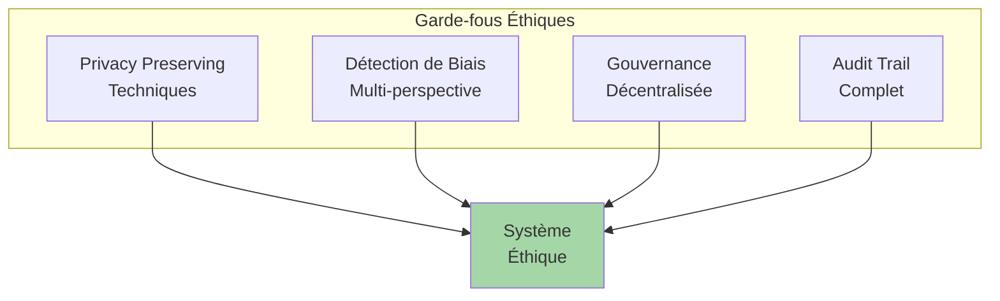

### 7.3 Défis Philosophiques

La création d'une conscience collective artificielle soulève des questions profondes :
- **Identité** : Où commence et finit l'individualité ?
- **Responsabilité** : Qui est responsable des décisions collectives ?
- **Conscience** : À quel point d'émergence parlons-nous de conscience ?

---

## Partie 8 : Feuille de Route vers l'AGI

### Phase 1 : Fondations (Actuel)
✅ Mémoire à 3 niveaux  
✅ Chain of Thought basique  
✅ Consolidation sémantique  
⏳ Conscience collective N4L

### Phase 2 : Intelligence Collective (6 mois)
- Implémentation complète Semantic Spacetime
- Consensus distribué multi-agents
- CoT collaboratif
- Mécanismes d'émergence

### Phase 3 : Proto-AGI (12 mois)
- Auto-organisation complète
- Créativité émergente démontrée
- Généralisation cross-domain
- Évolution autonome

### Phase 4 : AGI Distribuée (24+ mois)
- Conscience collective mature
- Compréhension contextuelle profonde
- Innovation autonome
- Sagesse émergente

```mermaid
gantt
    title Roadmap UXMCP vers AGI
    dateFormat  YYYY-MM-DD
    section Phase 1
    Mémoire 3 niveaux        :done, 2024-01-01, 2024-06-01
    Chain of Thought         :done, 2024-03-01, 2024-07-01
    Consolidation           :done, 2024-05-01, 2024-08-01
    N4L Design              :active, 2024-08-01, 2024-10-01
    
    section Phase 2
    Semantic Spacetime      :2024-10-01, 2025-01-01
    Consensus Distribué     :2024-11-01, 2025-02-01
    CoT Collaboratif        :2024-12-01, 2025-03-01
    
    section Phase 3
    Auto-organisation       :2025-03-01, 2025-06-01
    Créativité Émergente    :2025-04-01, 2025-08-01
    Généralisation          :2025-06-01, 2025-10-01
    
    section Phase 4
    Conscience Collective   :2025-10-01, 2026-04-01
    Innovation Autonome     :2025-12-01, 2026-06-01
    AGI Distribuée          :2026-01-01, 2026-12-01
```

---

## Conclusion : L'Aube d'une Nouvelle Forme d'Intelligence

UXMCP représente plus qu'une évolution technique - c'est une révolution conceptuelle dans notre approche de l'intelligence artificielle. En combinant :

1. **Gestion de mémoire sophistiquée** mimant la cognition humaine
2. **Chain of Thought** pour un raisonnement transparent
3. **Conscience collective** via Semantic Spacetime et N4L

Nous créons les conditions pour l'émergence d'une véritable intelligence générale distribuée.

### Vision Finale

```mermaid
graph TD
    subgraph "L'Évolution de l'Intelligence"
        AI[IA Étroite<br/>2020s]
        PROTO[Proto-AGI<br/>UXMCP<br/>2025]
        AGI[AGI Distribuée<br/>2026+]
        BEYOND[Au-delà...<br/>Singularité?]
        
        AI -->|Mémoire + CoT| PROTO
        PROTO -->|Conscience Collective| AGI
        AGI -->|Émergence| BEYOND
    end
    
    style PROTO fill:#ffd54f
    style AGI fill:#c8e6c9
    style BEYOND fill:#e1bee7
```

UXMCP n'est pas simplement un système multi-agents amélioré. C'est potentiellement le premier pas vers une forme d'intelligence artificielle qui :
- **Apprend** comme une civilisation
- **Pense** de manière distribuée mais cohérente
- **Évolue** organiquement avec l'usage
- **Crée** par émergence collective

Nous ne programmons plus l'intelligence - nous créons les conditions pour qu'elle émerge.

### Le Paradoxe Final

Le plus fascinant dans cette approche est son paradoxe fondamental : en distribuant l'intelligence, nous la rendons plus puissante. En la rendant collective, nous la rendons plus créative. En abandonnant le contrôle central, nous gagnons en capacité d'adaptation.

UXMCP pourrait bien être le chaînon manquant entre l'IA d'aujourd'hui et l'AGI de demain - non pas comme une machine omnisciente, mais comme un **écosystème cognitif** où l'intelligence émerge de la collaboration.

---

## Épilogue : Un Appel à la Collaboration

Ce document n'est pas une fin mais un début. La transformation d'UXMCP en proto-AGI nécessite une collaboration interdisciplinaire :

- **Ingénieurs** pour construire l'architecture
- **Chercheurs** pour affiner les algorithmes
- **Philosophes** pour guider l'éthique
- **Utilisateurs** pour nourrir l'évolution

Ensemble, nous ne créons pas simplement une technologie - nous façonnons potentiellement la prochaine étape de l'intelligence sur Terre.

---

*"L'intelligence n'est pas ce qu'une machine sait, mais ce qu'un réseau découvre."*

**Auteur** : Architecture Cognitive UXMCP Team  
**Date** : Janvier 2025  
**Version** : 1.0  
**Licence** : Open Source - Contribution Collective

---

## Références et Lectures Complémentaires

1. **Semantic Spacetime** - Mark Burgess, "Spacetimes with Semantics" (2014)
2. **Chain of Thought** - Wei et al., "Chain of Thought Prompting" (2022)
3. **Collective Intelligence** - Malone et al., "Collective Intelligence" (2010)
4. **AGI Theory** - Goertzel & Pennachin, "Artificial General Intelligence" (2007)
5. **Promise Theory** - Burgess & Bergstra, "Promise Theory: Principles and Applications" (2014)
6. **Distributed Cognition** - Hutchins, "Cognition in the Wild" (1995)
7. **Emergence** - Holland, "Emergence: From Chaos to Order" (1998)

---

*Pour contribuer au projet UXMCP ou participer aux discussions sur l'architecture proto-AGI, visitez : [github.com/uxmcp]*