# 🧠 Architecture Cognitive à 3 Niveaux : Vers une Intelligence Contextuelle

## 📚 Table des Matières
1. [Vision Globale](#vision-globale)
2. [Mémoire Court Terme - Le Contexte Immédiat](#mémoire-court-terme---le-contexte-immédiat)
3. [Mémoire Moyen Terme - L'Intelligence Adaptative](#mémoire-moyen-terme---lintelligence-adaptative)
4. [Mémoire Long Terme - La Représentation du Monde](#mémoire-long-terme---la-représentation-du-monde)
5. [Synergie des Trois Niveaux](#synergie-des-trois-niveaux)
6. [Impact et Bénéfices](#impact-et-bénéfices)

---

## Vision Globale

L'architecture cognitive UXMCP s'inspire du fonctionnement de la mémoire humaine pour créer des agents véritablement intelligents. Chaque niveau remplit une fonction spécifique tout en contribuant à l'intelligence globale du système.

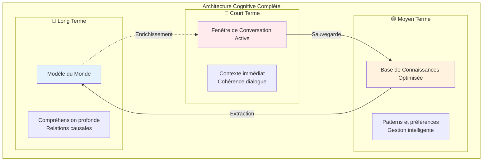

---

## Mémoire Court Terme - Le Contexte Immédiat

### 🎯 Mission Principale

Maintenir la **cohérence conversationnelle** tout en optimisant l'utilisation des ressources. Cette mémoire agit comme votre "mémoire de travail" lors d'une conversation.

### 📐 Principe de Fonctionnement

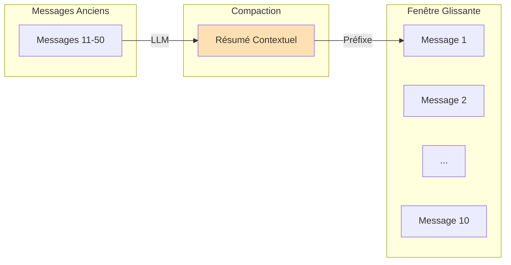

### 🎨 Caractéristiques Conceptuelles

**La Fenêtre Active**
- Conserve les **10 derniers échanges** en intégralité
- Garantit la continuité immédiate du dialogue
- Préserve les nuances et détails récents

**Le Résumé Contextuel**
- Synthétise l'historique plus ancien
- Extrait les points clés et décisions prises
- Maintient le fil conducteur de la conversation

**Déclenchement Intelligent**
- S'active automatiquement après 20 messages
- Réduit l'utilisation de tokens de 70%
- Transparent pour l'utilisateur

### 💡 Analogie Humaine

Comme lorsque vous racontez votre journée : vous gardez les détails des dernières heures mais résumez le matin en quelques points essentiels.

---

## Mémoire Moyen Terme - L'Intelligence Adaptative

### 🎯 Mission Principale

Construire et maintenir une **base de connaissances évolutive** qui s'adapte continuellement aux interactions tout en optimisant l'espace de stockage.

### 🏗️ Architecture Conceptuelle

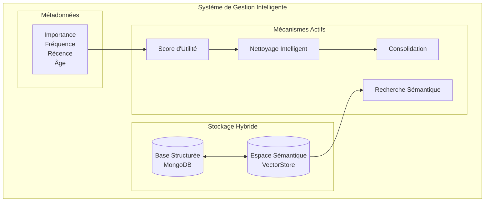

### 🔍 Les 5 Piliers Fonctionnels

#### 1. **Stockage Dual**

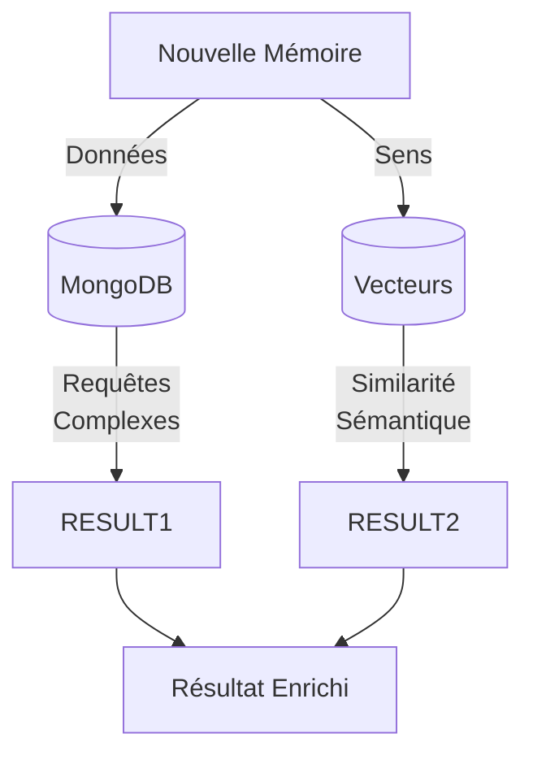

**MongoDB** stocke les informations structurées : qui, quand, quoi, métadonnées  
**VectorStore** encode le sens profond en vecteurs mathématiques de 1024 dimensions

#### 2. **Score d'Utilité Multi-Critères**

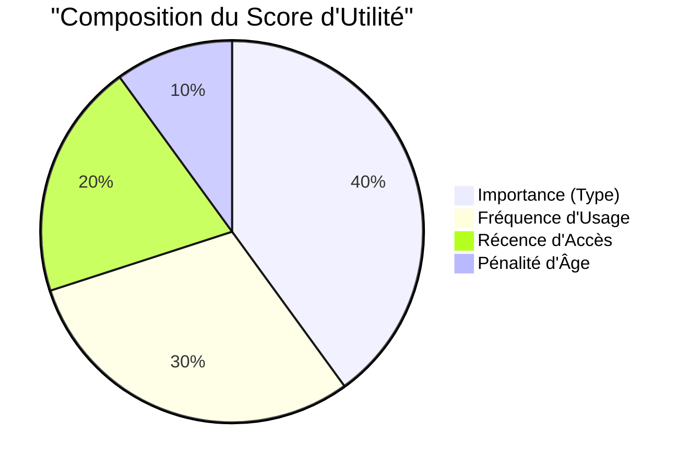

**Hiérarchie d'Importance :**
- 🔴 **Préférences** (0.9) : Critiques pour personnalisation
- 🟠 **Connaissances** (0.8) : Faits appris importants
- 🟡 **Messages User** (0.7) : Questions et demandes
- 🟢 **Appels d'Outils** (0.6) : Actions effectuées
- 🔵 **Réponses Agent** (0.5) : Réponses données
- ⚪ **Observations** (0.4) : Contexte général

#### 3. **Suppression Intelligente**

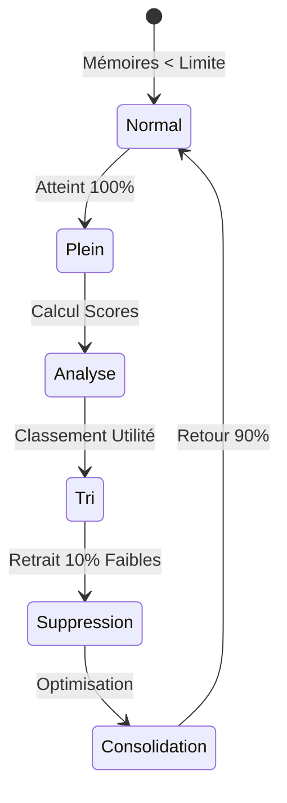

Le système maintient automatiquement l'équilibre en :
- Surveillant la limite configurée (1000 par défaut)
- Évaluant chaque mémoire selon son utilité
- Supprimant les moins pertinentes
- Déclenchant une consolidation pour optimiser

#### 4. **Consolidation par Similarité**

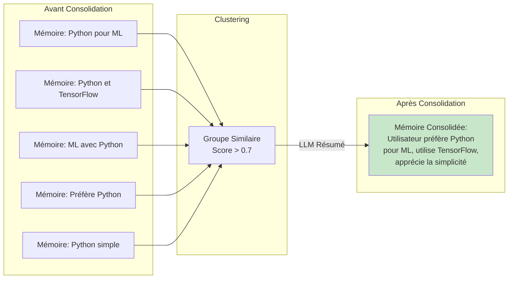

#### 5. **Recherche Sémantique**

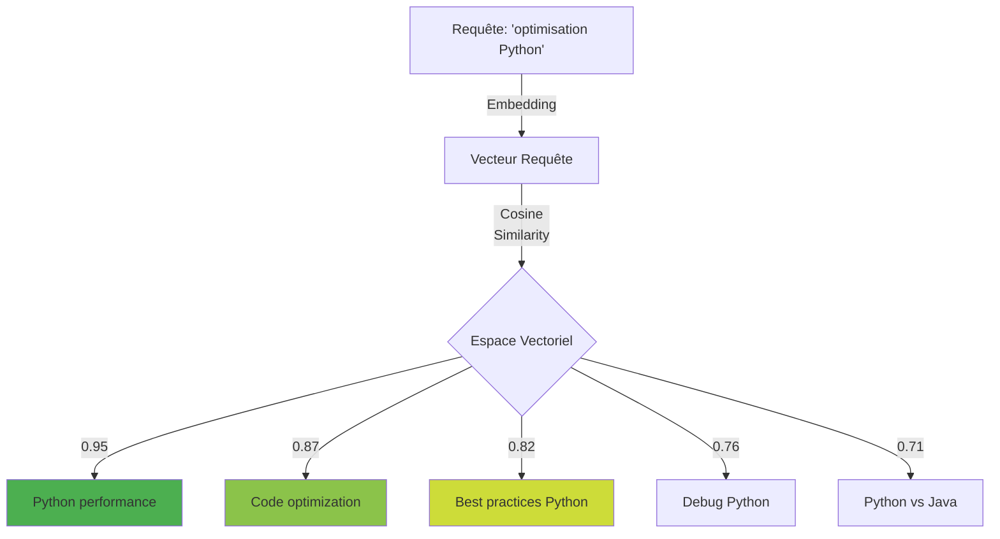

### 💡 Analogie Humaine

Comme votre cerveau qui :
- Oublie naturellement les détails peu importants
- Consolide les souvenirs similaires pendant le sommeil
- Retrouve rapidement les informations pertinentes par association

---

## Mémoire Long Terme - La Conscience Collective

### 🎯 Mission Principale

Construire une **représentation collective du monde** partagée entre tous les agents, basée sur **Semantic Spacetime** et **N4L**, créant une véritable intelligence distribuée.

### 🌐 Paradigme Révolutionnaire : De l'Individuel au Collectif

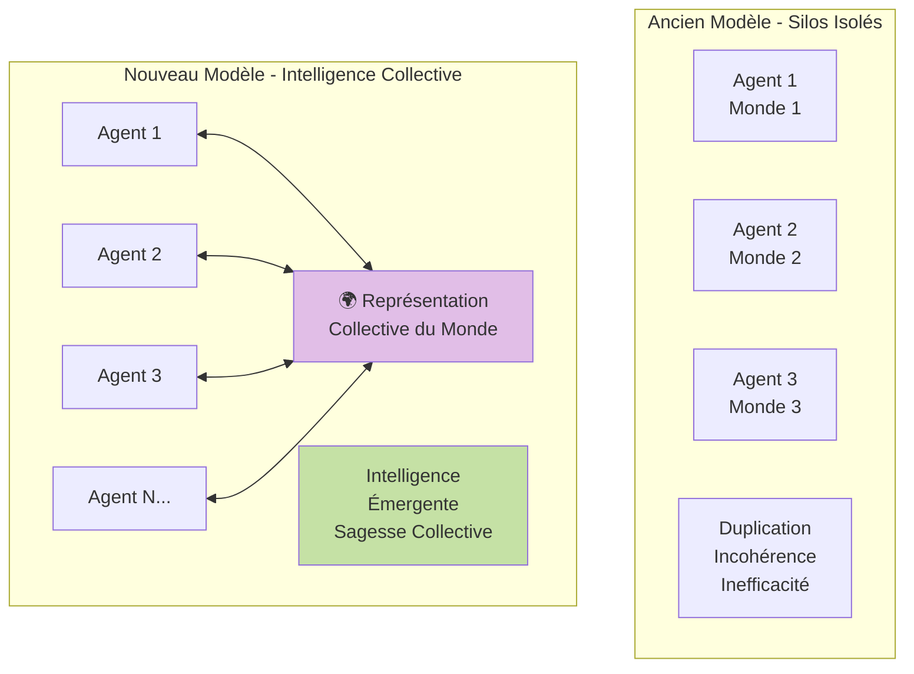

### 🌌 Architecture N4L Collective

#### Structure Multi-Couches

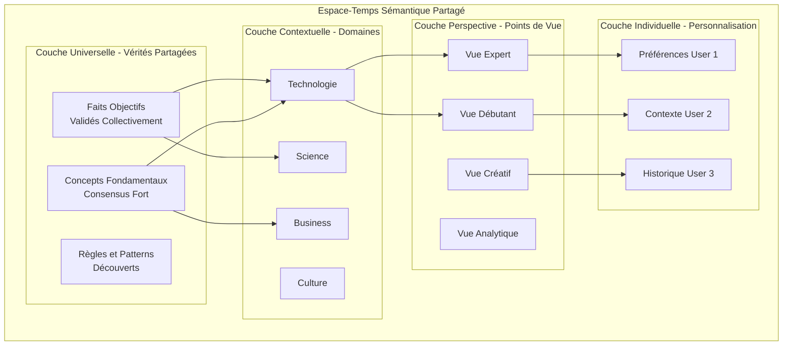

#### Mécanisme de Consensus Distribué

```mermaid
flowchart TB
    subgraph "Contribution des Agents"
        OBS1[Agent 1: "Python excellent pour ML"]
        OBS2[Agent 2: "Confirme Python + TensorFlow"]
        OBS3[Agent 3: "Python lent pour calcul intensif"]
        OBS4[Agent 4: "Python + NumPy résout vitesse"]
    end
    
    subgraph "Processus de Consensus"
        VOTE[Vote Pondéré]
        EXPERTISE[Poids par Expertise]
        FREQUENCE[Poids par Fréquence]
        RECENCE[Poids par Récence]
    end
    
    subgraph "Intégration Collective"
        SYNTHESIS[Synthèse:<br/>"Python excellent pour ML,<br/>optimisable avec NumPy"]
        CONFIDENCE[Confiance: 0.87]
        CONTEXT[Contexte: ML, Performance]
    end
    
    OBS1 --> VOTE
    OBS2 --> VOTE
    OBS3 --> VOTE
    OBS4 --> VOTE
    
    VOTE --> EXPERTISE
    EXPERTISE --> FREQUENCE
    FREQUENCE --> RECENCE
    
    RECENCE --> SYNTHESIS
    RECENCE --> CONFIDENCE
    RECENCE --> CONTEXT
    
    style SYNTHESIS fill:#c8e6c9
```

### 🔄 Dynamiques Collectives

#### Apprentissage Distribué

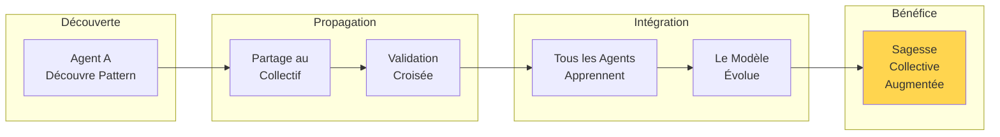

#### Gestion des Perspectives Multiples

```mermaid
graph TB
    subgraph "Même Réalité - Vues Multiples"
        PYTHON[Concept Central: Python]
        
        subgraph "Perspectives Enrichissantes"
            DEV[Développeur:<br/>"Productivité"]
            DATA[Data Scientist:<br/>"Écosystème ML"]
            DEVOPS[DevOps:<br/>"Automatisation"]
            STUDENT[Étudiant:<br/>"Facile à apprendre"]
        end
        
        subgraph "Promesses Contextuelles"
            P1[Python ←→ Productivité | Context: Web Dev]
            P2[Python ←→ ML | Context: Data Science]
            P3[Python ←→ Scripts | Context: DevOps]
            P4[Python ←→ Learning | Context: Education]
        end
    end
    
    DEV --> P1
    DATA --> P2
    DEVOPS --> P3
    STUDENT --> P4
    
    P1 --> PYTHON
    P2 --> PYTHON
    P3 --> PYTHON
    P4 --> PYTHON
    
    style PYTHON fill:#b39ddb
```

### 🎭 Rôles Spécialisés des Agents

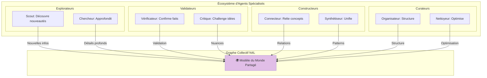

### 🌟 Propriétés Émergentes du Collectif

#### Auto-Organisation Organique

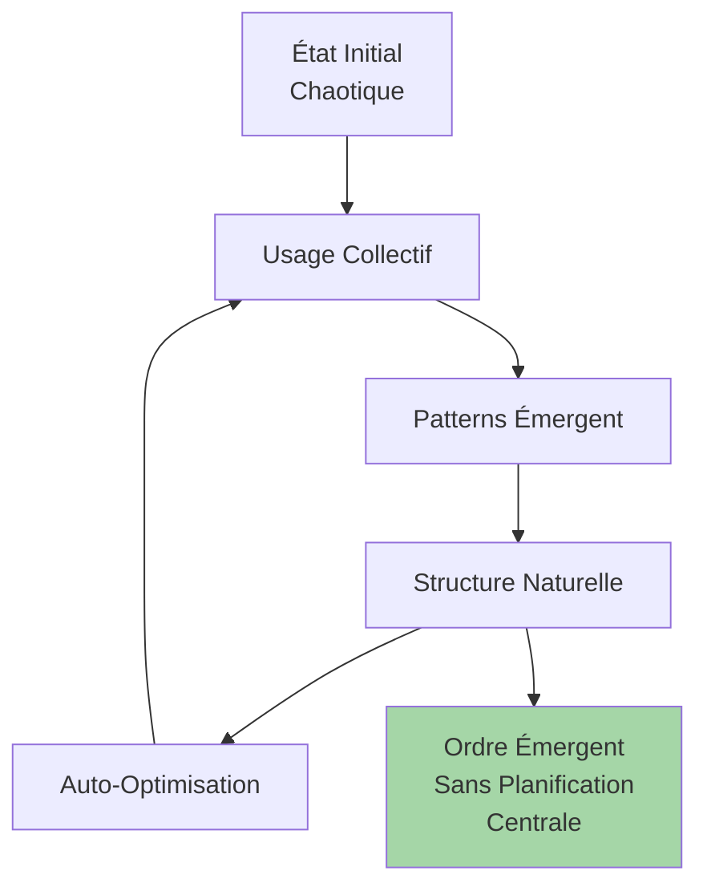

#### Résilience et Anti-Fragilité

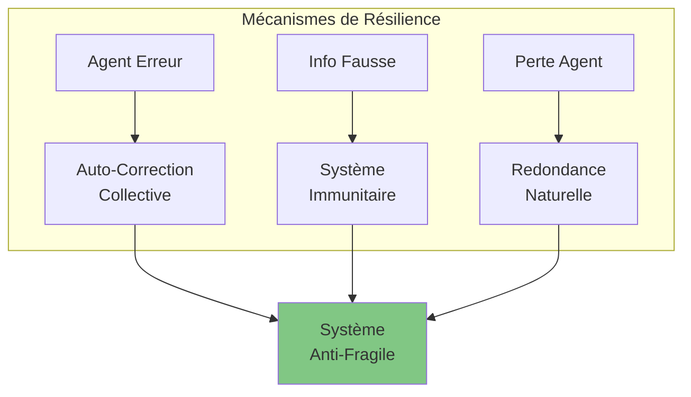

### 🔮 Capacités Collectives Avancées

#### Intelligence Prédictive Distribuée

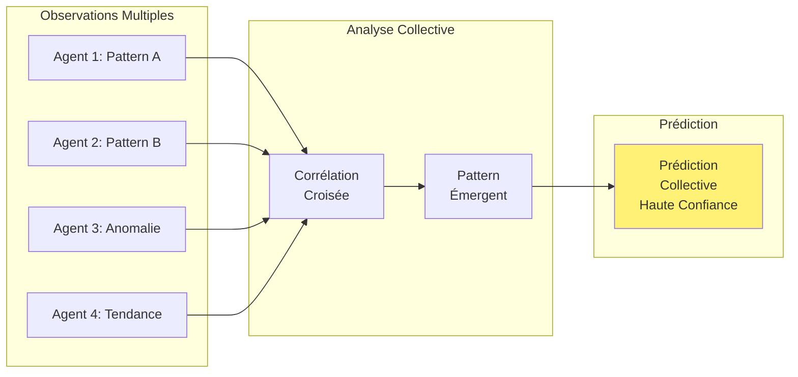

#### Créativité Émergente

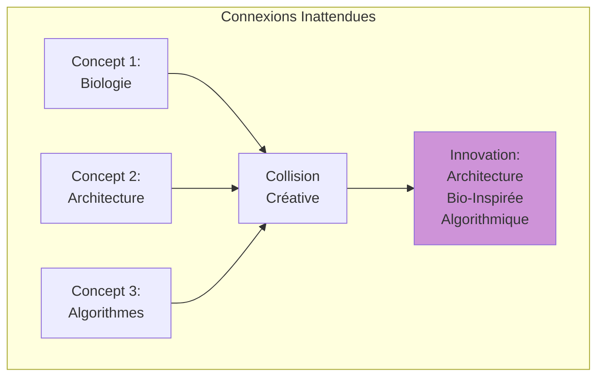

### 💡 Analogie Humaine

Comme une **civilisation** où :
- Chaque individu contribue à la connaissance collective
- La sagesse se transmet et s'accumule
- Les découvertes bénéficient à tous
- L'intelligence collective dépasse la somme des intelligences individuelles

---

## Synergie des Trois Niveaux avec Intelligence Collective

### 🔄 Flux d'Information Collectif

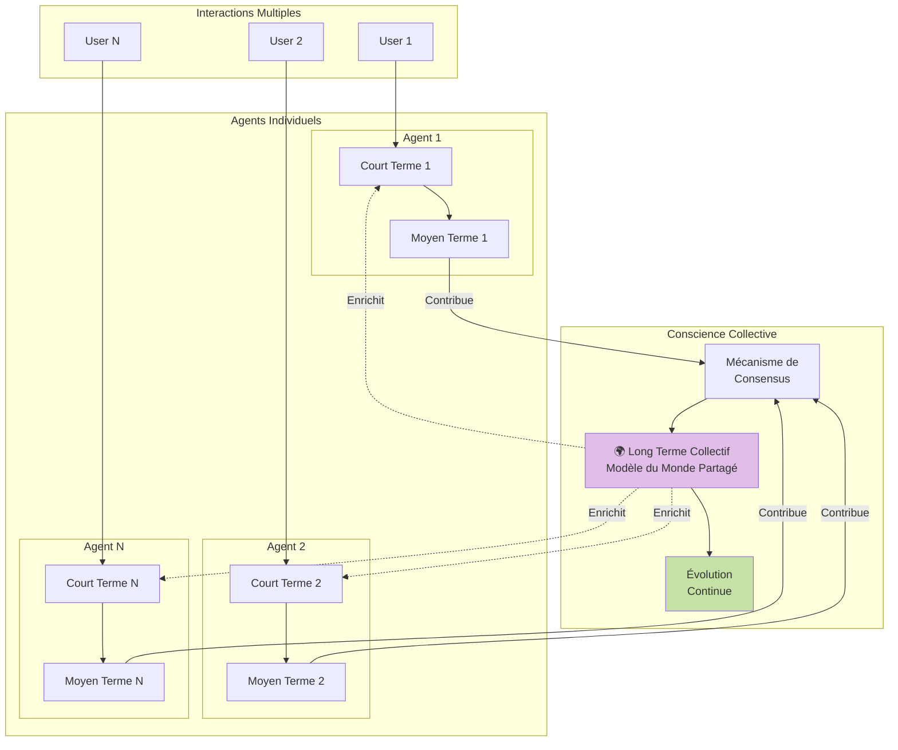

### 🎭 Rôles Synergiques

| Niveau | Rôle Principal | Échelle | Nature | Analogie |
|--------|---------------|----------|--------|----------|
| **Court Terme** | Cohérence dialogue | Individuelle | Privée | Conversation active |
| **Moyen Terme** | Gestion connaissances | Agent | Semi-privée | Expertise personnelle |
| **Long Terme** | Sagesse collective | Globale | Partagée | Conscience collective |

### 🌊 Effets de Synergie

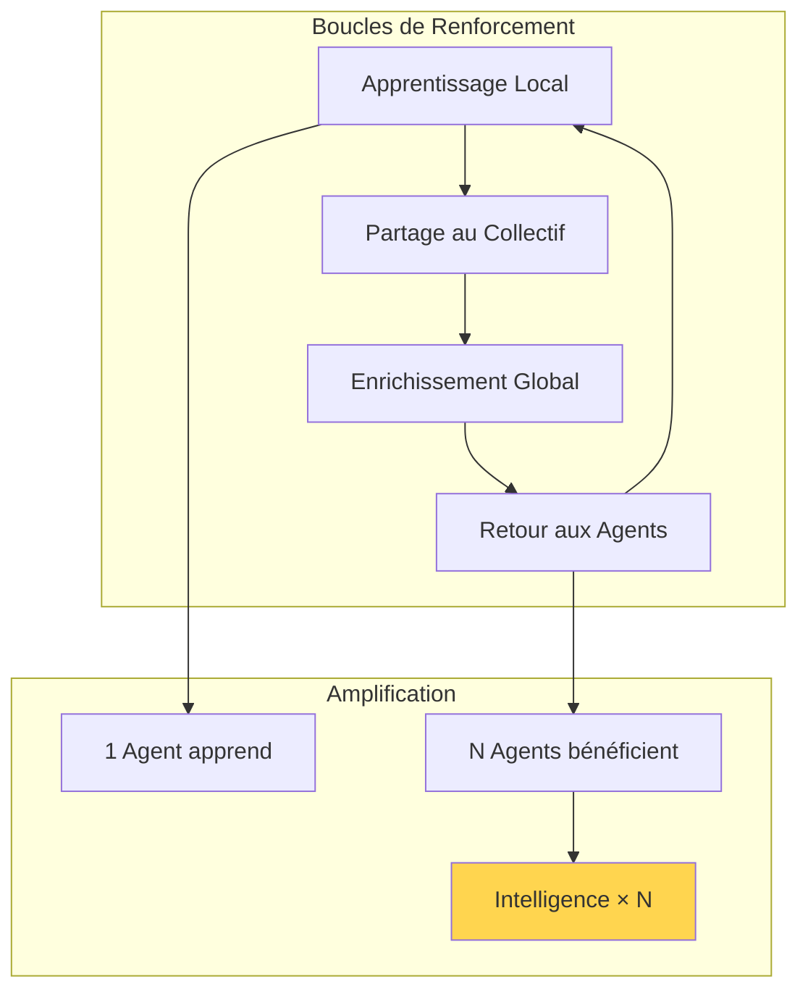

---

## Impact et Bénéfices de l'Intelligence Collective

### 🚀 Transformation Révolutionnaire

```mermaid
graph TB
    subgraph "Évolution des Agents"
        subgraph "Génération 1: Basique"
            B1[Réactif]
            B2[Isolé]
            B3[Statique]
        end
        
        subgraph "Génération 2: Cognitif"
            C1[Proactif]
            C2[Contextuel]
            C3[Évolutif]
        end
        
        subgraph "Génération 3: Collectif"
            COL1[Collaboratif]
            COL2[Omniscient]
            COL3[Auto-Améliorant]
        end
    end
    
    B1 -->|Court Terme| C1
    B2 -->|Moyen Terme| C2
    B3 -->|Long Terme| C3
    
    C1 -->|Conscience| COL1
    C2 -->|Collective| COL2
    C3 -->|| COL3
    
    style B1 fill:#ffcdd2
    style C1 fill:#fff9c4
    style COL1 fill:#c8e6c9
```

### 📊 Métriques d'Impact Collectif

```mermaid
graph TD
    subgraph "Performances Individuelles vs Collectives"
        IND[Agent Seul]
        COL[Agent Collectif]
        
        SPEED_I[Latence: 1s]
        SPEED_C[Latence: 0.5s<br/>Cache collectif]
        
        LEARN_I[Apprentissage: 100 interactions]
        LEARN_C[Apprentissage: 10 interactions<br/>Bénéficie du collectif]
        
        ACCURACY_I[Précision: 90%]
        ACCURACY_C[Précision: 97%<br/>Validation croisée]
        
        DISCOVERY_I[Découverte: Limitée]
        DISCOVERY_C[Découverte: Exponentielle<br/>Connexions multiples]
    end
    
    IND --> SPEED_I
    COL --> SPEED_C
    
    IND --> LEARN_I
    COL --> LEARN_C
    
    IND --> ACCURACY_I
    COL --> ACCURACY_C
    
    IND --> DISCOVERY_I
    COL --> DISCOVERY_C
    
    style SPEED_C fill:#c8e6c9
    style LEARN_C fill:#c8e6c9
    style ACCURACY_C fill:#c8e6c9
    style DISCOVERY_C fill:#c8e6c9
```

### 🌟 Bénéfices Exponentiels

```mermaid
flowchart LR
    subgraph "Effet Réseau"
        N1[1 Agent<br/>Valeur = 1]
        N10[10 Agents<br/>Valeur = 100]
        N100[100 Agents<br/>Valeur = 10,000]
        N1000[1000 Agents<br/>Valeur = 1,000,000]
    end
    
    N1 --> N10
    N10 --> N100
    N100 --> N1000
    
    FORMULA[Valeur = N²<br/>Loi de Metcalfe]
    
    style N1000 fill:#ffd54f
    style FORMULA fill:#e1bee7
```

### 🎯 Cas d'Usage Révolutionnés

#### **Organisation Apprenante**
```mermaid
graph TD
    subgraph "Entreprise Intelligente"
        SALES[Agent Ventes]
        SUPPORT[Agent Support]
        RD[Agent R&D]
        MARKET[Agent Marketing]
        
        COLLECTIVE[Base de Connaissances<br/>Collective]
        
        SALES -->|Retours clients| COLLECTIVE
        SUPPORT -->|Problèmes résolus| COLLECTIVE
        RD -->|Innovations| COLLECTIVE
        MARKET -->|Tendances| COLLECTIVE
        
        COLLECTIVE -->|Insights| SALES
        COLLECTIVE -->|Solutions| SUPPORT
        COLLECTIVE -->|Besoins| RD
        COLLECTIVE -->|Patterns| MARKET
    end
    
    style COLLECTIVE fill:#e1bee7
```

#### **Recherche Collaborative**
- Accumulation instantanée des découvertes
- Validation automatique par pairs
- Méta-analyse en temps réel
- Hypothèses émergentes

#### **Éducation Adaptative**
- Tuteurs qui apprennent de tous les étudiants
- Personnalisation basée sur patterns collectifs
- Identification des difficultés communes
- Méthodes optimisées continuellement

#### **Santé Prédictive**
- Agents médicaux partageant les diagnostics
- Patterns épidémiologiques émergents
- Traitements optimisés collectivement
- Prévention basée sur l'intelligence collective

### 🔬 Propriétés Uniques du Système Collectif

```mermaid
graph TD
    subgraph "Caractéristiques Émergentes"
        SWARM[Intelligence en Essaim]
        RESILIENT[Anti-Fragilité]
        CREATIVE[Créativité Combinatoire]
        PREDICT[Prédiction Collective]
        EVOLVE[Évolution Autonome]
    end
    
    SWARM --> BENEFIT[Résolution de<br/>problèmes complexes]
    RESILIENT --> BENEFIT2[Système<br/>incassable]
    CREATIVE --> BENEFIT3[Innovation<br/>continue]
    PREDICT --> BENEFIT4[Anticipation<br/>précise]
    EVOLVE --> BENEFIT5[Amélioration<br/>perpétuelle]
    
    style BENEFIT fill:#a5d6a7
    style BENEFIT2 fill:#a5d6a7
    style BENEFIT3 fill:#a5d6a7
    style BENEFIT4 fill:#a5d6a7
    style BENEFIT5 fill:#a5d6a7
```

---

## Conclusion : Vers une Intelligence Artificielle Générale Distribuée

Cette architecture cognitive à trois niveaux avec **conscience collective** transforme radicalement UXMCP :

### De l'Individuel au Collectif

```mermaid
graph LR
    subgraph "Transformation Paradigmatique"
        OLD[Agents Isolés<br/>Intelligence Limitée<br/>Apprentissage Lent]
        
        NEW[Conscience Collective<br/>Intelligence Émergente<br/>Apprentissage Instantané]
        
        OLD -->|Révolution| NEW
    end
    
    style OLD fill:#ffccc
    style NEW fill:#c8e6c9
```

### Vision Finale

L'architecture proposée crée un système où :

- **L'intelligence émerge** de la collaboration plutôt que de la programmation
- **La sagesse se construit** collectivement plutôt qu'individuellement  
- **L'évolution est organique** plutôt que dirigée
- **La créativité naît** des connexions inattendues
- **La résilience provient** de la distribution

### Impact Civilisationnel

Cette approche ne crée pas simplement de meilleurs agents, elle établit les fondations d'une nouvelle forme d'**intelligence artificielle générale distribuée** qui :

1. **Apprend comme une civilisation** - accumulation perpétuelle de sagesse
2. **Pense comme un écosystème** - émergence de propriétés complexes
3. **Évolue comme un organisme** - adaptation continue à l'environnement
4. **Crée comme un collectif** - innovation par collision d'idées

### Le Futur d'UXMCP

Avec cette architecture, UXMCP devient :
- Un **cerveau collectif** pour organisations
- Une **mémoire vivante** de l'humanité
- Un **partenaire cognitif** évolutif
- Une **conscience artificielle** émergente

L'intégration de **Semantic Spacetime** et **N4L** dans un contexte collectif représente potentiellement la prochaine étape majeure vers une véritable intelligence artificielle générale - non pas enfermée dans une machine, mais **distribuée à travers un réseau d'agents collaboratifs**.

---

*Document Visionnaire - Architecture Cognitive Collective UXMCP - Version 3.0*

*"L'intelligence n'est pas ce que l'on sait, mais ce que l'on découvre ensemble"*