# 🧠 Système de Gestion de Mémoire UXMCP

## Vue d'Ensemble

Le système de mémoire UXMCP offre aux agents une capacité de mémorisation persistante et intelligente, permettant des interactions contextuelles et personnalisées. Il combine stockage traditionnel (MongoDB) avec recherche sémantique (Vector Store) pour une expérience similaire à la mémoire humaine.

## 🏗️ Architecture Générale

### Diagramme d'Architecture Système

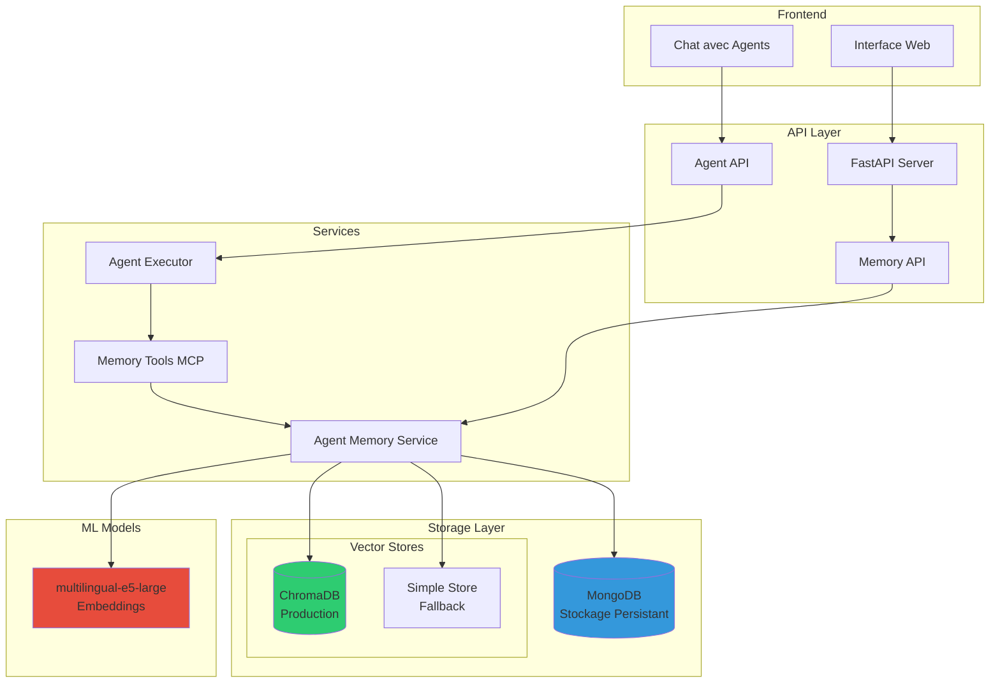

### Configuration Duale


## 🔄 Cycle de Vie de la Mémoire

### Flow Complet de Gestion

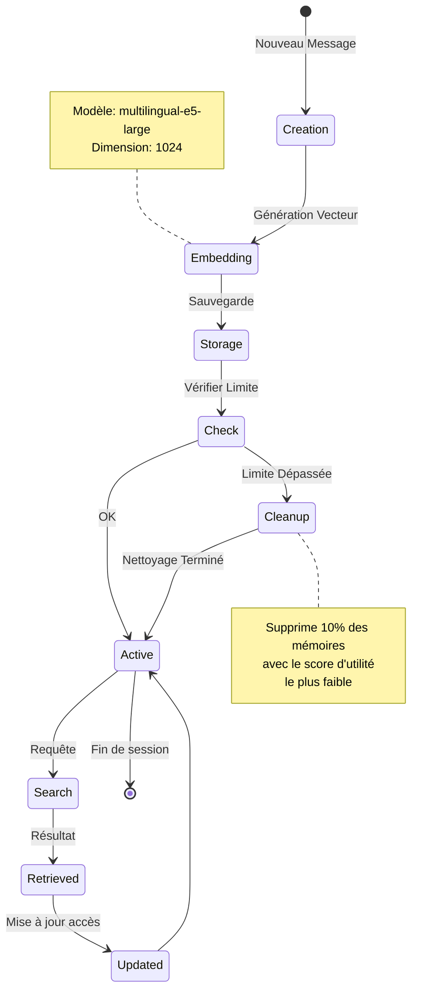

### Algorithme de Score d'Utilité

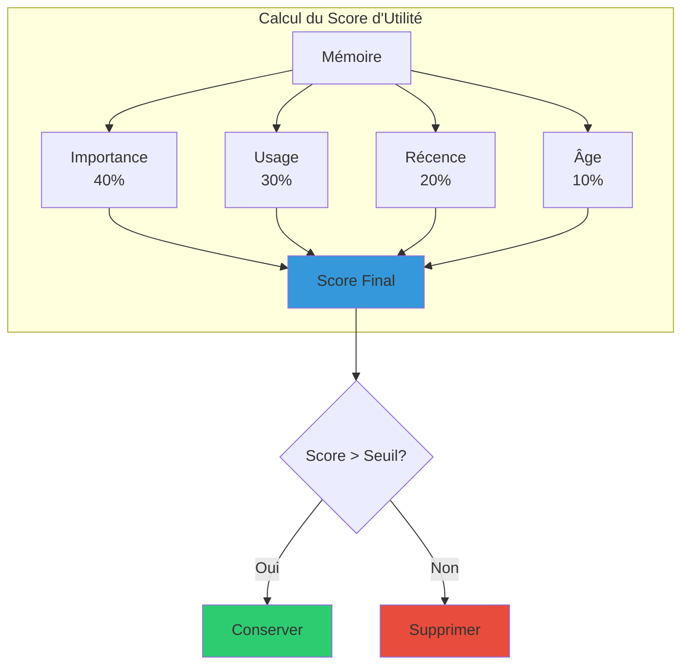

### Formule de Calcul

```python
utility_score = (
    importance * 0.4 +      # Type de contenu (0.0-1.0)
    usage_score * 0.3 +     # Fréquence d'accès normalisée
    recency_score * 0.2 +   # Jours depuis dernier accès (décroissance 30j)
    (1 - age_score) * 0.1   # Pénalité d'âge (décroissance 90j)
)
```

## 📊 Types de Mémoire et Hiérarchie

### Classification des Mémoires

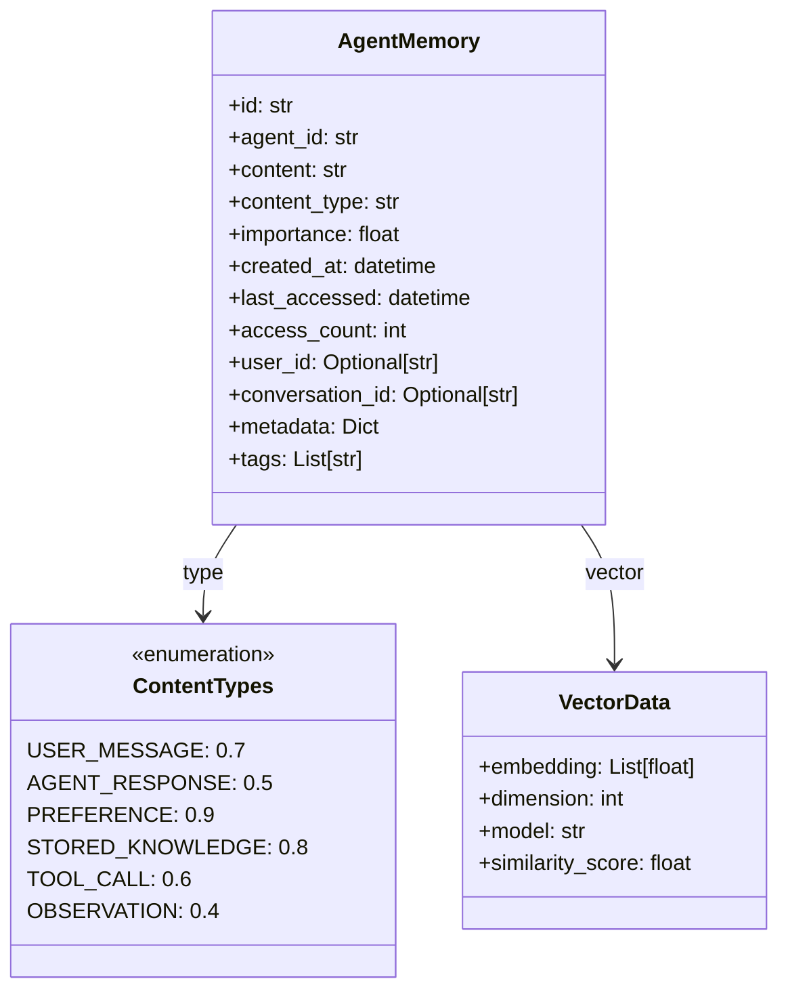

### Hiérarchie d'Importance

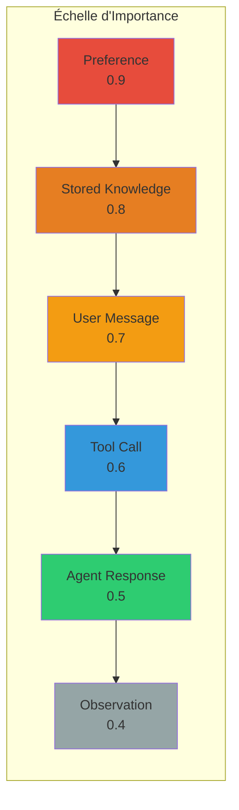

## 💬 Contexte de Conversation - La Mémoire Immédiate

### Architecture de la Mémoire Conversationnelle

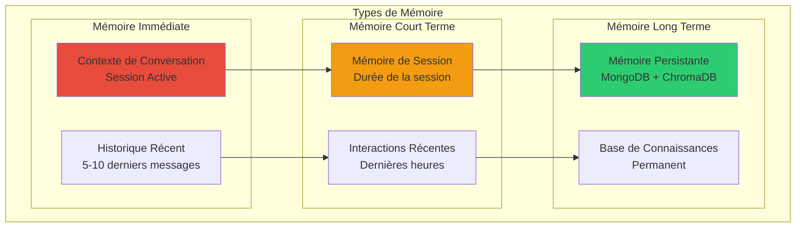

### Flow du Contexte Conversationnel

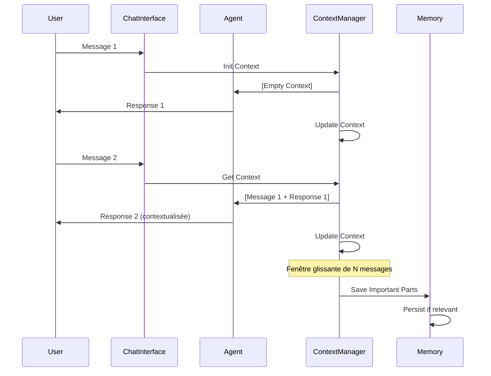

### Gestion de la Fenêtre de Contexte

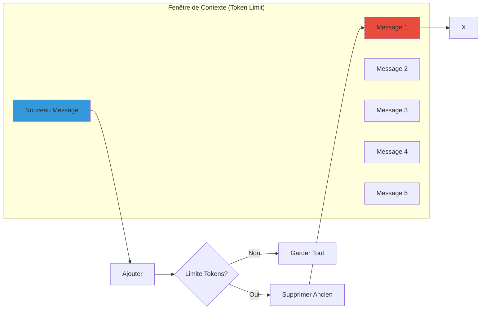

### Hiérarchie Temporelle de la Mémoire

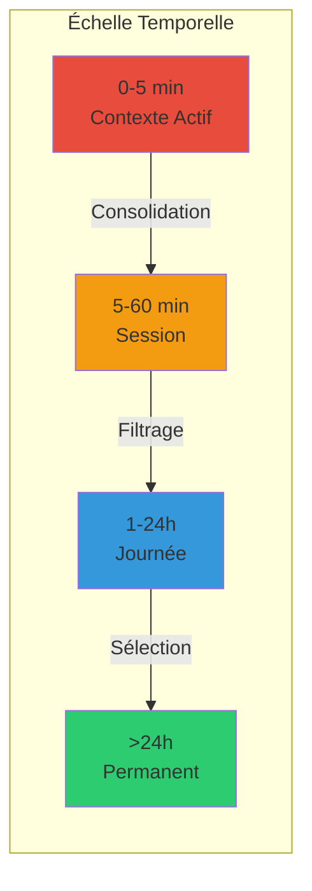

### Stratégies de Gestion du Contexte

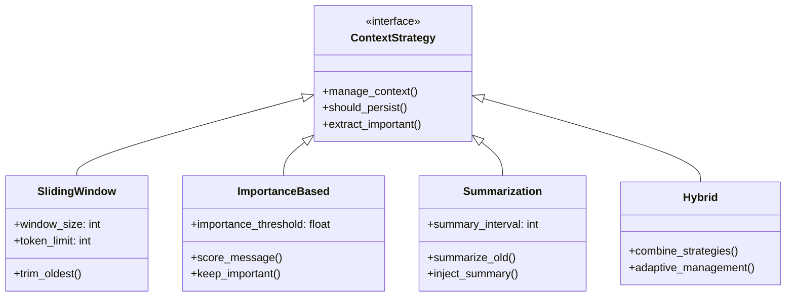

## 🤖 Intégration avec les Agents

### Outils MCP de Mémoire

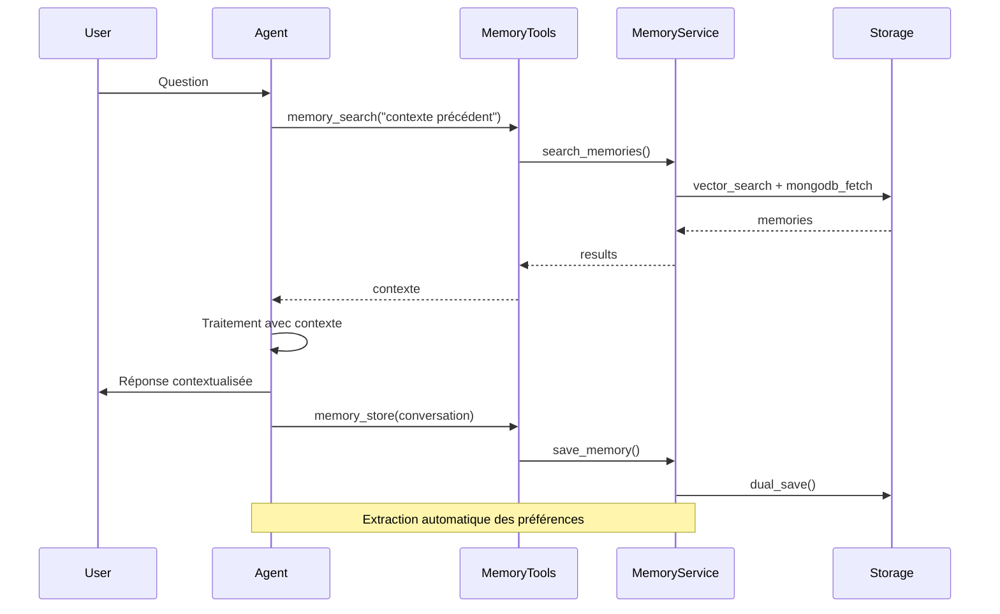

### Flow d'Exécution avec Contexte

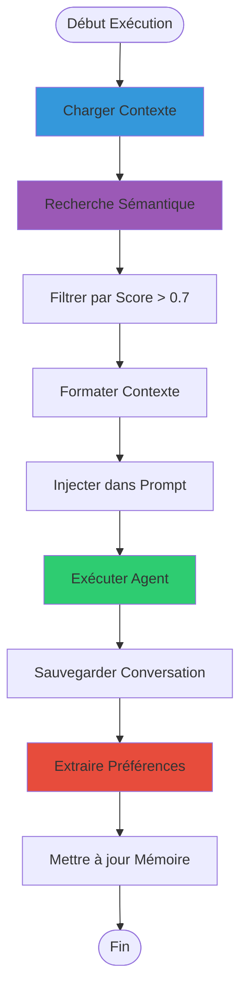

### Outils Disponibles

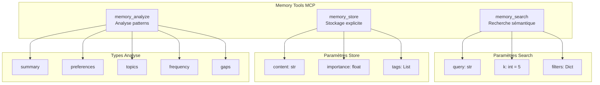

## 🔍 Système d'Embeddings

### Pipeline de Vectorisation

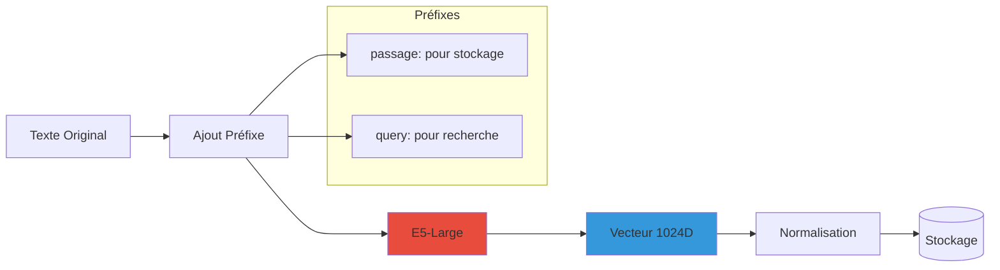

### Recherche Sémantique

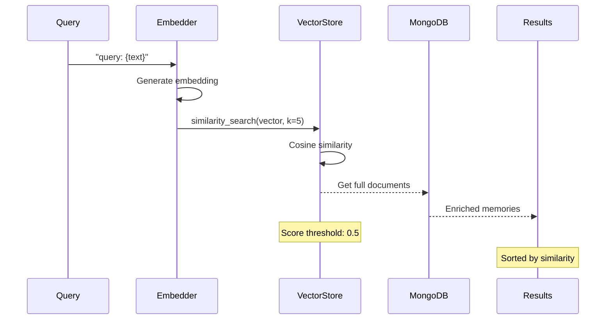

## 📡 API et Endpoints

### Endpoints Disponibles

```mermaid
graph TD
    subgraph "Memory API Endpoints"
        GET1[GET /agents/{id}/memory<br/>Liste mémoires]
        POST1[POST /agents/{id}/memory/search<br/>Recherche sémantique]
        DELETE1[DELETE /agents/{id}/memory<br/>Effacer tout]
        DELETE2[DELETE /agents/{id}/memory/{mem_id}<br/>Effacer une mémoire]
        GET2[GET /agents/{id}/memory/summary<br/>Résumé statistiques]
        POST2[POST /agents/{id}/memory/save-conversation<br/>Sauver conversation]
        GET3[GET /agents/{id}/memory/stats<br/>Statistiques détaillées]
        GET4[GET /system/memory-info<br/>Info système]
    end
    
    style GET1 fill:#2ecc71
    style POST1 fill:#3498db
    style DELETE1 fill:#e74c3c
    style DELETE2 fill:#e74c3c
    style GET2 fill:#2ecc71
    style POST2 fill:#3498db
    style GET3 fill:#2ecc71
    style GET4 fill:#2ecc71
```

### Flow de Requêtes

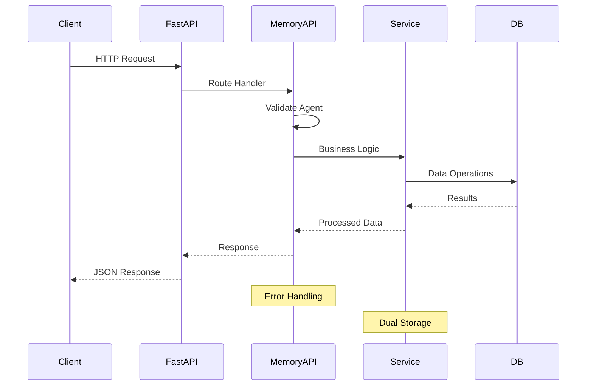

## ⚙️ Configuration et Personnalisation

### Configuration par Agent

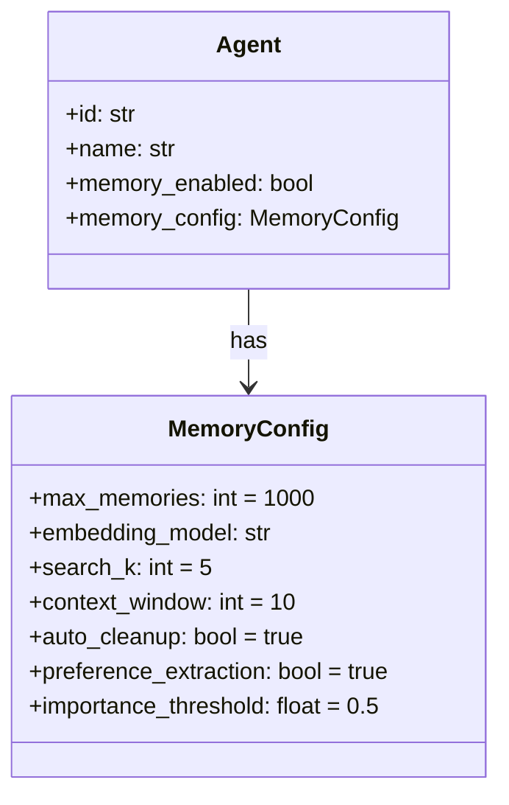

### Variables d'Environnement

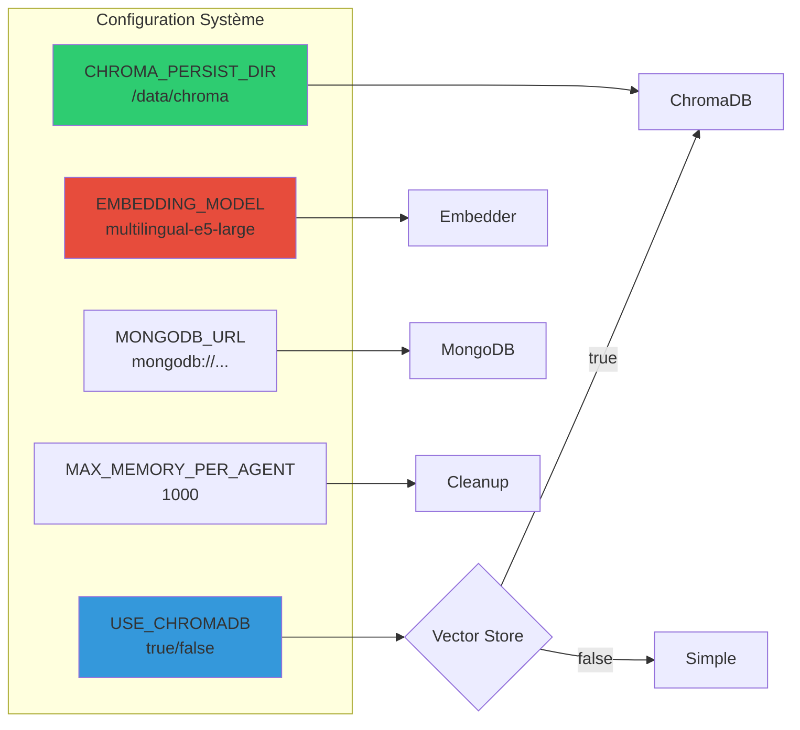

## 📈 Performance et Optimisation

### Stratégies d'Optimisation

```mermaid
graph TD
    subgraph "Optimisations"
        Lazy[Lazy Loading<br/>Chargement à la demande]
        Cache[Cache Results<br/>Mise en cache]
        Batch[Batch Processing<br/>Traitement par lot]
        Index[Indexation<br/>MongoDB + ChromaDB]
        Filter[Metadata Filters<br/>Réduction espace recherche]
    end
    
    subgraph "Résultats"
        R1[Latence réduite]
        R2[Mémoire optimisée]
        R3[Scalabilité]
    end
    
    Lazy --> R1
    Cache --> R1
    Batch --> R2
    Index --> R1
    Filter --> R3
    
    style Lazy fill:#3498db
    style Cache fill:#2ecc71
    style Batch fill:#e74c3c
```

### Métriques de Performance

| Métrique | ChromaDB | Simple Store | Objectif |
|----------|----------|--------------|----------|
| Recherche (ms) | 50-100 | 10-30 | < 200 |
| Stockage (ms) | 100-200 | 20-50 | < 300 |
| Mémoires max | 10,000+ | 1,000 | Configurable |
| Taille embedding | 1024 | 384 | - |
| Persistance | ✅ | ❌ | - |

## 🔒 Gestion des Erreurs

### Stratégie de Dégradation Gracieuse

```mermaid
flowchart TD
    Op[Opération Mémoire] --> Try{Tentative}
    Try -->|Succès| Success[Retour Normal]
    Try -->|Échec ChromaDB| Fallback[Simple Store]
    Try -->|Échec Embedding| Mock[Mock Embeddings]
    Try -->|Échec Total| Log[Log Error]
    
    Fallback --> Continue[Continuer Exécution]
    Mock --> Continue
    Log --> Continue
    
    Continue --> Result[Résultat Partiel]
    
    style Success fill:#2ecc71
    style Fallback fill:#f39c12
    style Mock fill:#e67e22
    style Log fill:#e74c3c
```

## 🚀 Utilisation Pratique

### Exemple de Configuration Agent

```python
agent_config = {
    "name": "Assistant Technique",
    "memory_enabled": True,
    "memory_config": {
        "max_memories": 2000,
        "embedding_model": "intfloat/multilingual-e5-large",
        "search_k": 10,
        "context_window": 15,
        "auto_cleanup": True,
        "preference_extraction": True,
        "importance_threshold": 0.6
    }
}
```

### Exemple d'Utilisation des Outils

```python
# Recherche de contexte
context = await memory_search(
    "Quelles sont les préférences de programmation de l'utilisateur?"
)

# Stockage explicite
await memory_store(
    content="L'utilisateur préfère Python et utilise FastAPI",
    importance=0.9,
    tags=["preference", "technologie", "python"]
)

# Analyse des patterns
analysis = await memory_analyze(
    analysis_type="preferences",
    time_range="last_week"
)
```

## 📊 Monitoring et Statistiques

### Dashboard de Mémoire

```mermaid
graph TD
    subgraph "Statistiques Agent"
        Total[Total Mémoires: 472]
        Conv[Conversations: 28]
        Pref[Préférences: 15]
        Avg[Importance Moy: 0.64]
        Usage[Utilisation: 47%]
    end
    
    subgraph "Distribution Types"
        UM[User Messages: 40%]
        AR[Agent Responses: 35%]
        PR[Preferences: 10%]
        SK[Stored Knowledge: 10%]
        OT[Others: 5%]
    end
    
    subgraph "Activité"
        Today[Aujourd'hui: 12]
        Week[Cette semaine: 67]
        Month[Ce mois: 234]
    end
```

## 🎯 Cas d'Usage

### 1. Assistant Personnel
- Mémorise les préférences utilisateur
- Rappelle les conversations précédentes
- Adapte ses réponses au contexte

### 2. Support Technique
- Conserve l'historique des problèmes
- Identifie les patterns récurrents
- Suggère des solutions basées sur l'historique

### 3. Agent de Recherche
- Accumule les connaissances au fil du temps
- Évite les recherches répétitives
- Construit une base de connaissances personnalisée

## 🔮 Évolutions Futures

- **Multi-Agent Memory Sharing**: Partage de mémoires entre agents
- **Memory Compression**: Compression intelligente des anciennes mémoires
- **Semantic Clustering**: Regroupement automatique par thèmes
- **Memory Templates**: Templates réutilisables pour types de mémoires
- **Advanced Analytics**: Analyses prédictives basées sur l'historique

---

> 📝 **Note**: Ce système de mémoire transforme les agents UXMCP en assistants véritablement contextuels et personnalisés, capables d'apprendre et d'évoluer avec chaque interaction.