# 🧠 Système de Gestion de Mémoire UXMCP

## Vue d'Ensemble

Le système de mémoire UXMCP offre aux agents une capacité de mémorisation persistante et intelligente, permettant des interactions contextuelles et personnalisées. Il combine stockage traditionnel (MongoDB) avec recherche sémantique (Vector Store) pour une expérience similaire à la mémoire humaine.

## 🏗️ Architecture Générale

### Diagramme d'Architecture Système

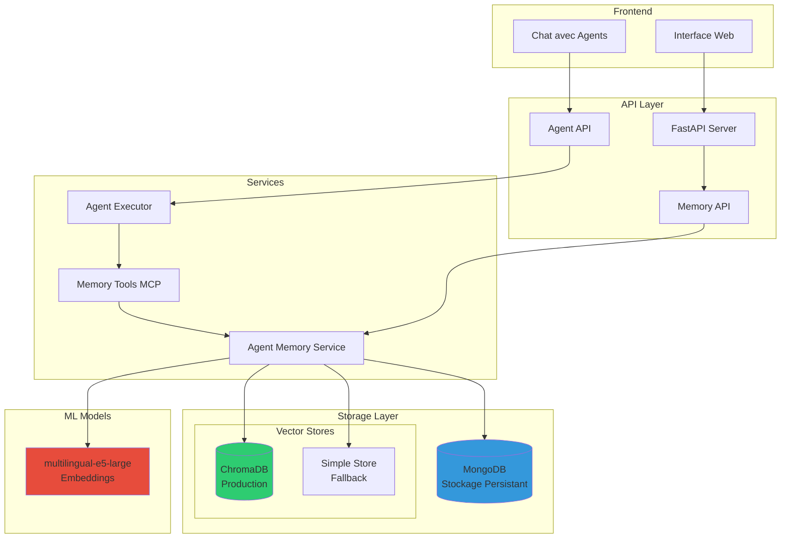

### Configuration Duale

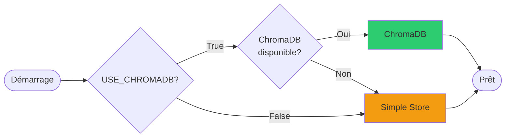

## 🔄 Cycle de Vie de la Mémoire

### Flow Complet de Gestion

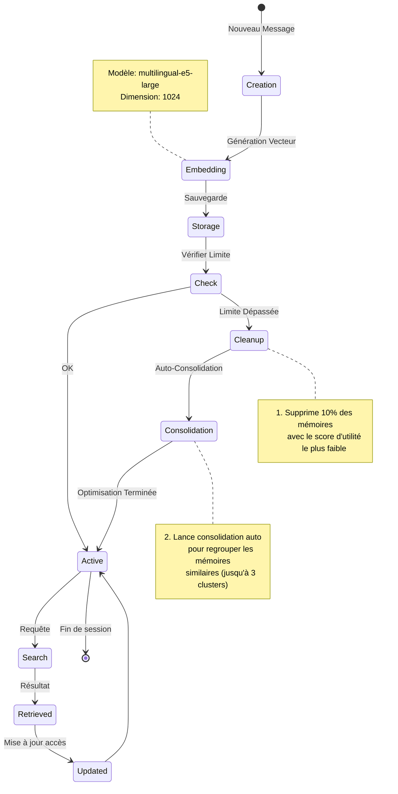

### Algorithme de Score d'Utilité

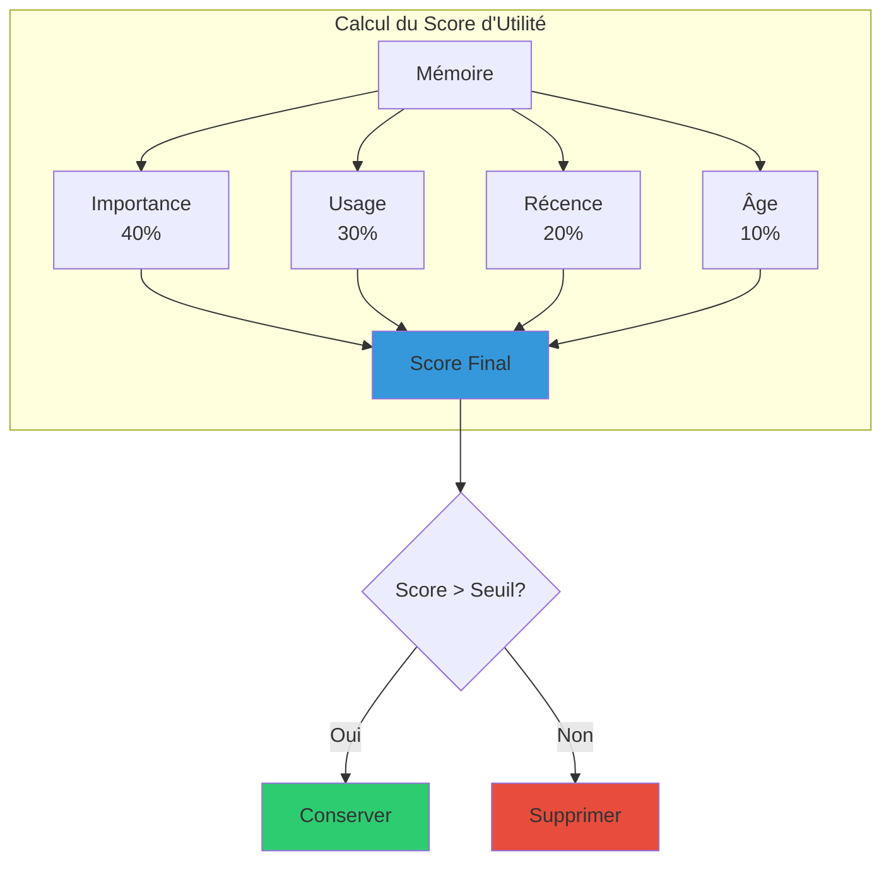

### Formule de Calcul

```python
utility_score = (
    importance * 0.4 +      # Type de contenu (0.0-1.0)
    usage_score * 0.3 +     # Fréquence d'accès normalisée
    recency_score * 0.2 +   # Jours depuis dernier accès (décroissance 30j)
    (1 - age_score) * 0.1   # Pénalité d'âge (décroissance 90j)
)
```

## 🔄 Système de Consolidation de Mémoire

### Vue d'Ensemble de la Consolidation

Le système de consolidation regroupe intelligemment les mémoires similaires pour optimiser l'espace de stockage tout en préservant les informations importantes. Ce processus s'inspire de la consolidation de mémoire humaine pendant le sommeil.

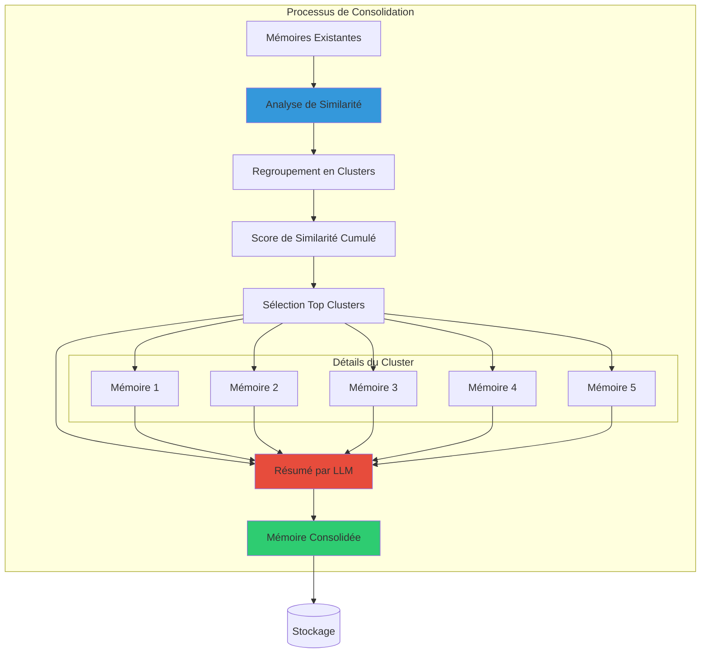

### Algorithme de Consolidation

#### 1. Calcul de Similarité

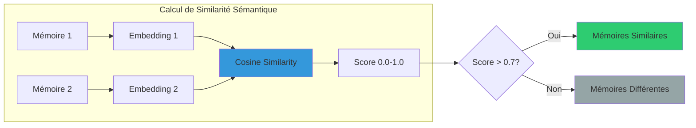

#### 2. Scoring Cumulé

Pour chaque mémoire, on calcule un score cumulé basé sur ses 5 voisins les plus similaires :

```python
# Pour chaque mémoire
for memory in all_memories:
    # Trouver les 5 mémoires les plus similaires
    top_5_similar = find_top_5_similar(memory)
    
    # Calculer le score cumulé
    cumulative_score = sum(similarity_scores)
    average_score = cumulative_score / 5
```

#### 3. Consolidation par LLM

Les clusters avec les scores les plus élevés sont consolidés par un LLM qui :
- Préserve les informations clés
- Élimine les redondances
- Crée un résumé cohérent
- Assigne une importance élevée (0.9)

### Déclenchement de la Consolidation

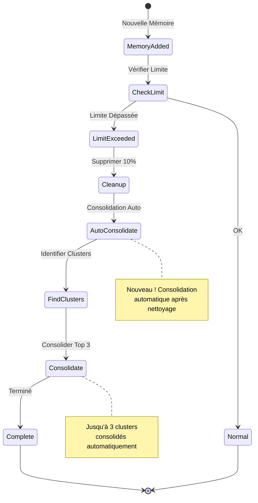

### Consolidation Manuelle

L'interface permet également de déclencher manuellement la consolidation :

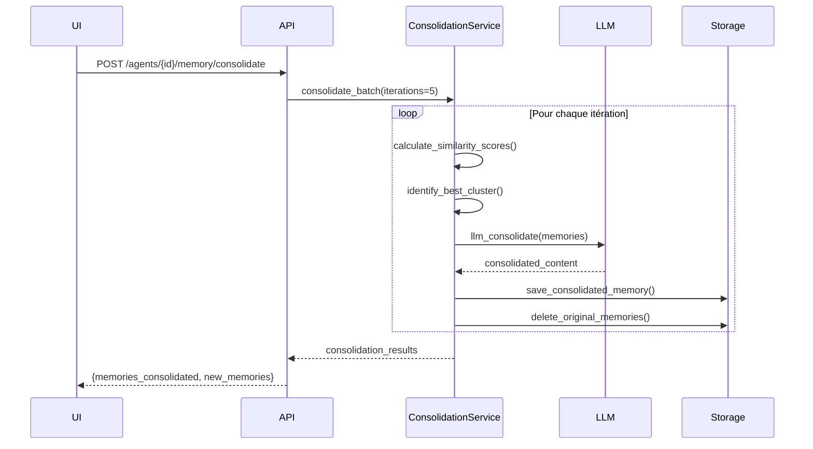

### API Endpoints de Consolidation

```mermaid
graph TD
    subgraph "Endpoints de Consolidation"
        Preview[GET /agents/{id}/memory/consolidation-preview<br/>Aperçu des clusters]
        Consolidate[POST /agents/{id}/memory/consolidate<br/>Lancer consolidation]
    end
    
    subgraph "Paramètres"
        P1[iterations: int = 5<br/>Nombre de clusters à consolider]
    end
    
    subgraph "Réponse Preview"
        R1[clusters_found: int]
        R2[clusters: List[ClusterInfo]]
    end
    
    subgraph "Réponse Consolidate"
        R3[memories_consolidated: int]
        R4[new_consolidated_memories: int]
        R5[consolidations: List[Result]]
    end
    
    Consolidate --> P1
    Preview --> R1
    Preview --> R2
    Consolidate --> R3
    Consolidate --> R4
    Consolidate --> R5
    
    style Preview fill:#2ecc71
    style Consolidate fill:#3498db
```

### Avantages de la Consolidation

1. **Optimisation de l'espace** : Réduit le nombre de mémoires tout en préservant l'information
2. **Amélioration de la qualité** : Les mémoires consolidées ont une importance élevée (0.9)
3. **Élimination des redondances** : Fusionne les informations répétitives
4. **Performance accrue** : Moins de mémoires à parcourir lors des recherches
5. **Contexte enrichi** : Les résumés consolidés offrent une vue d'ensemble cohérente

### Configuration de la Consolidation

```yaml
consolidation_config:
  min_similarity: 0.7          # Seuil de similarité minimum
  cluster_size: 5              # Taille minimale d'un cluster
  auto_trigger: true           # Consolidation après nettoyage
  auto_iterations: 3           # Nombre de clusters auto
  manual_iterations: 5         # Nombre de clusters manuel
  consolidated_importance: 0.9 # Importance des mémoires consolidées
```

## 📊 Types de Mémoire et Hiérarchie

### Classification des Mémoires

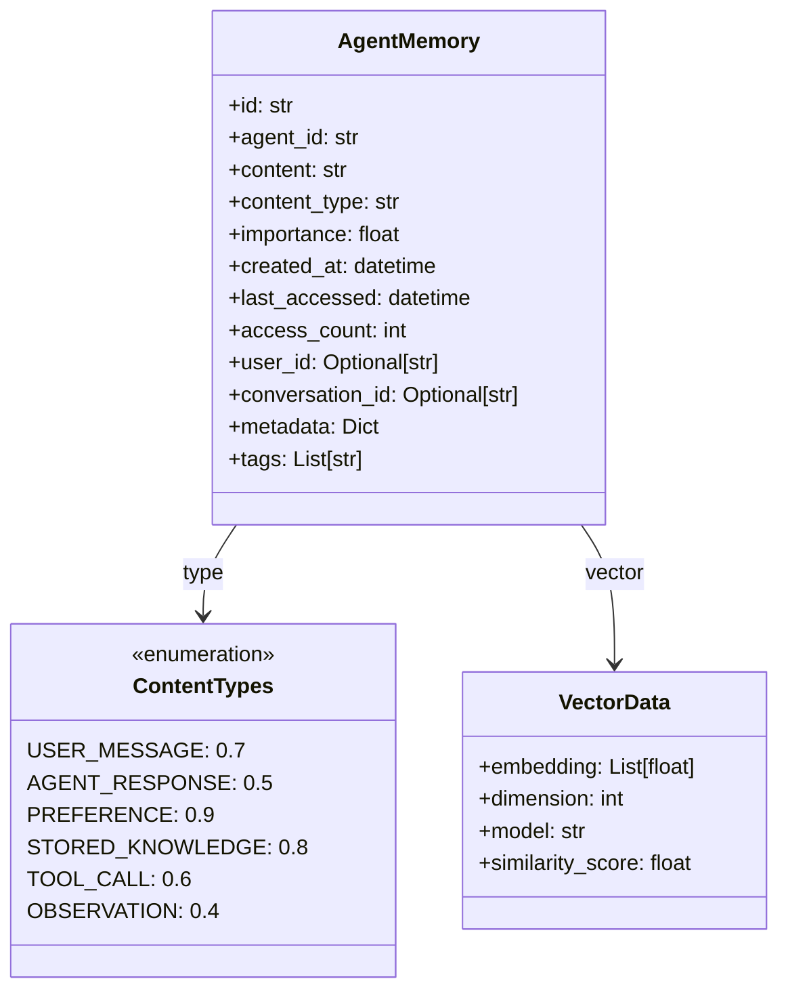

### Hiérarchie d'Importance

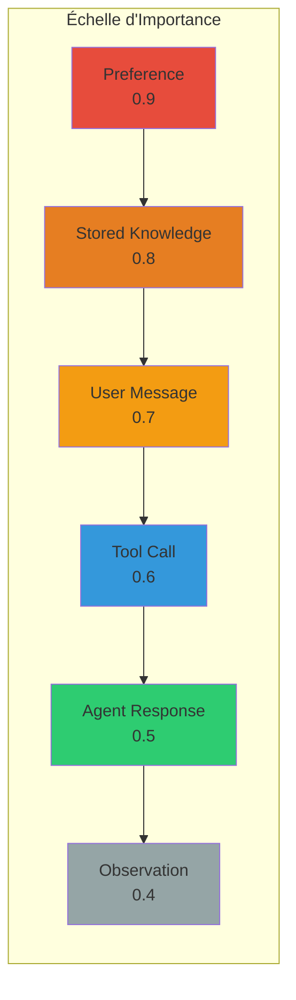

## 💬 Contexte de Conversation - La Mémoire Immédiate

### Architecture de la Mémoire Conversationnelle

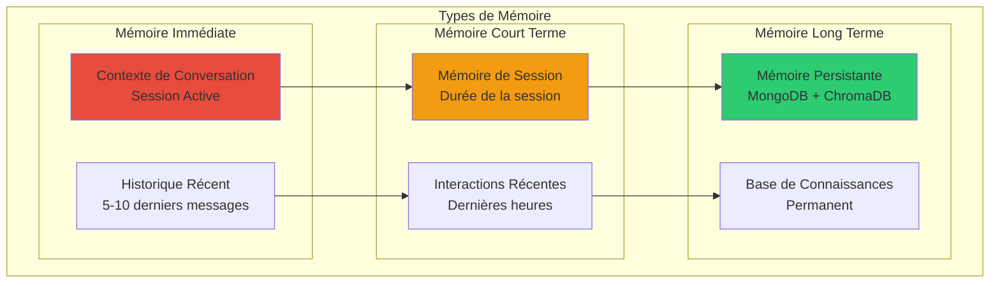

### Flow du Contexte Conversationnel

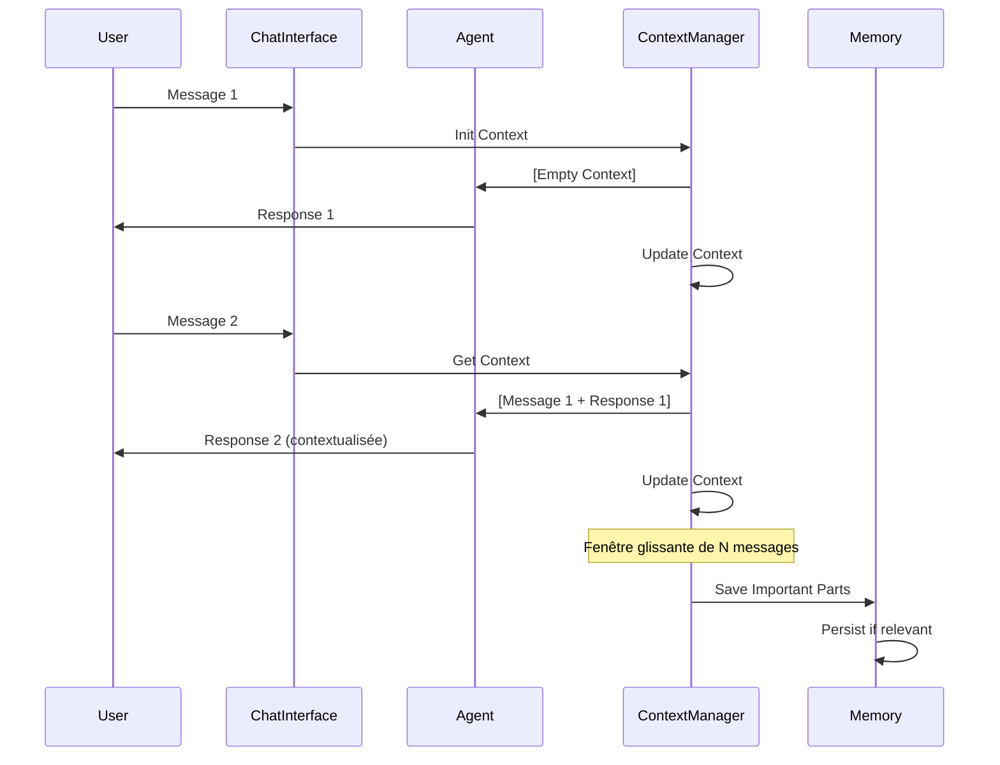

### Gestion de la Fenêtre de Contexte

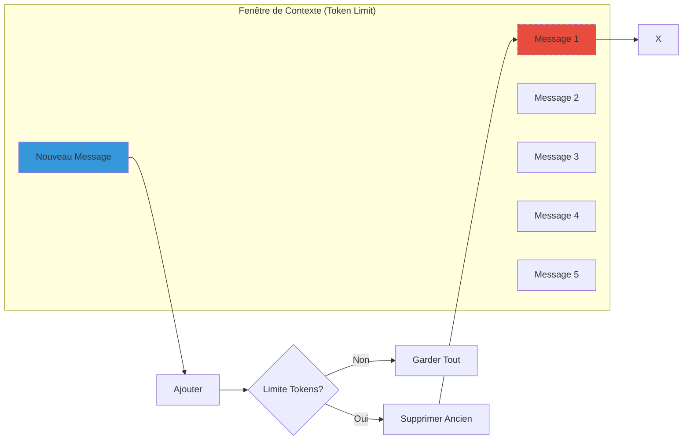

### Hiérarchie Temporelle de la Mémoire

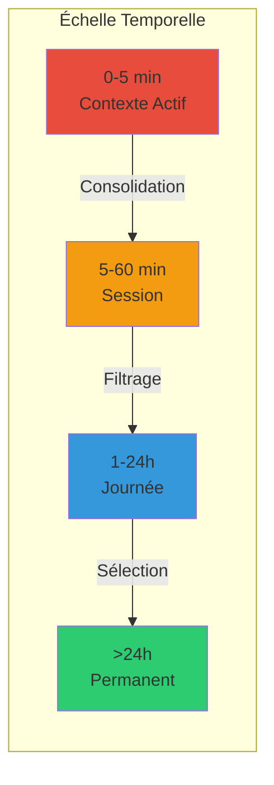

### Stratégies de Gestion du Contexte

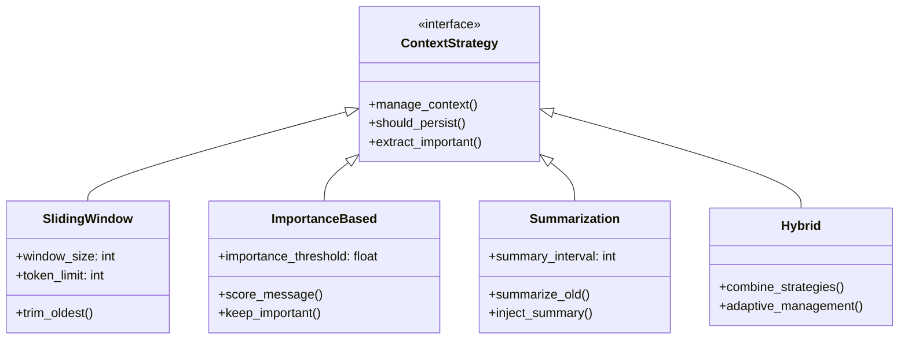

## 🤖 Intégration avec les Agents

### Outils MCP de Mémoire

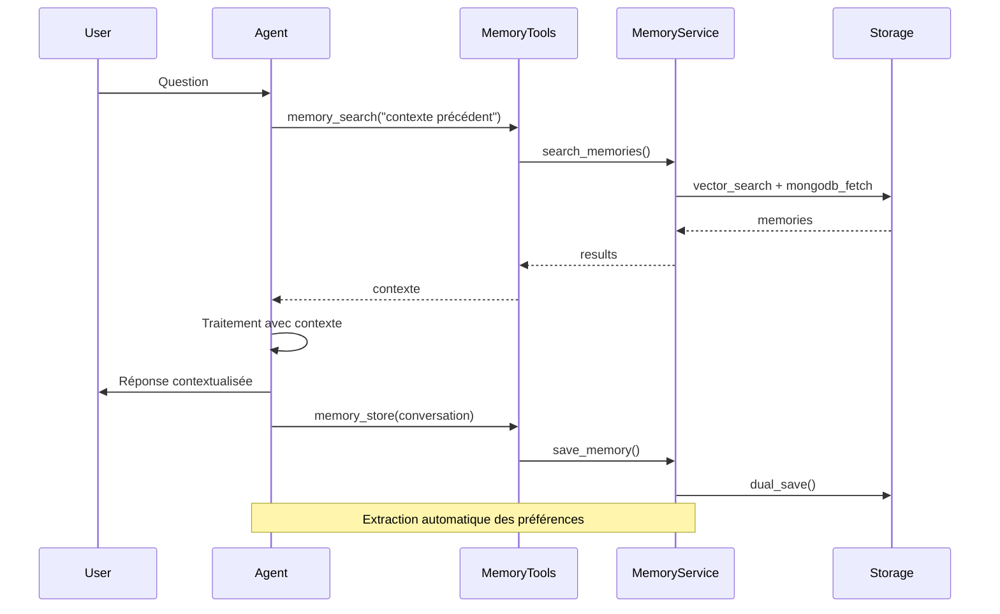

### Flow d'Exécution avec Contexte


### Outils Disponibles

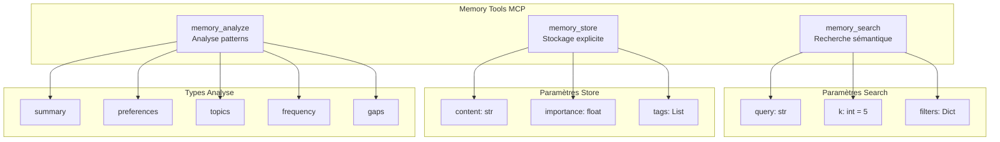

## 🔍 Système d'Embeddings

### Pipeline de Vectorisation

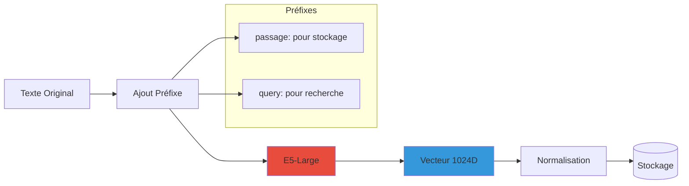

### Recherche Sémantique

```mermaid
sequenceDiagram
    participant Query
    participant Embedder
    participant VectorStore
    participant MongoDB
    participant Results
    
    Query->>Embedder: "query: {text}"
    Embedder->>Embedder: Generate embedding
    Embedder->>VectorStore: similarity_search(vector, k=5)
    VectorStore->>VectorStore: Cosine similarity
    VectorStore-->>MongoDB: Get full documents
    MongoDB-->>Results: Enriched memories
    
    Note over VectorStore: Score threshold: 0.5
    Note over Results: Sorted by similarity
```

## 📡 API et Endpoints

### Endpoints Disponibles

```mermaid
graph TD
    subgraph "Memory API Endpoints"
        GET1[GET /agents/{id}/memory<br/>Liste mémoires]
        POST1[POST /agents/{id}/memory/search<br/>Recherche sémantique]
        DELETE1[DELETE /agents/{id}/memory<br/>Effacer tout]
        DELETE2[DELETE /agents/{id}/memory/{mem_id}<br/>Effacer une mémoire]
        GET2[GET /agents/{id}/memory/summary<br/>Résumé statistiques]
        POST2[POST /agents/{id}/memory/save-conversation<br/>Sauver conversation]
        GET3[GET /agents/{id}/memory/stats<br/>Statistiques détaillées]
        GET4[GET /system/memory-info<br/>Info système]
        GET5[GET /agents/{id}/memory/consolidation-preview<br/>Aperçu consolidation]
        POST3[POST /agents/{id}/memory/consolidate<br/>Lancer consolidation]
    end
    
    style GET1 fill:#2ecc71
    style POST1 fill:#3498db
    style DELETE1 fill:#e74c3c
    style DELETE2 fill:#e74c3c
    style GET2 fill:#2ecc71
    style POST2 fill:#3498db
    style GET3 fill:#2ecc71
    style GET4 fill:#2ecc71
    style GET5 fill:#2ecc71
    style POST3 fill:#f39c12
```

### Flow de Requêtes

```mermaid
sequenceDiagram
    participant Client
    participant FastAPI
    participant MemoryAPI
    participant Service
    participant DB
    
    Client->>FastAPI: HTTP Request
    FastAPI->>MemoryAPI: Route Handler
    MemoryAPI->>MemoryAPI: Validate Agent
    MemoryAPI->>Service: Business Logic
    Service->>DB: Data Operations
    DB-->>Service: Results
    Service-->>MemoryAPI: Processed Data
    MemoryAPI-->>FastAPI: Response
    FastAPI-->>Client: JSON Response
    
    Note over MemoryAPI: Error Handling
    Note over Service: Dual Storage
```

## ⚙️ Configuration et Personnalisation

### Configuration par Agent

```mermaid
classDiagram
    class MemoryConfig {
        +max_memories: int = 1000
        +embedding_model: str
        +search_k: int = 5
        +context_window: int = 10
        +auto_cleanup: bool = true
        +preference_extraction: bool = true
        +importance_threshold: float = 0.5
    }
    
    class Agent {
        +id: str
        +name: str
        +memory_enabled: bool
        +memory_config: MemoryConfig
    }
    
    Agent --> MemoryConfig: has
```

### Variables d'Environnement

```mermaid
graph LR
    subgraph "Configuration Système"
        ENV1[USE_CHROMADB<br/>true/false]
        ENV2[CHROMA_PERSIST_DIR<br/>/data/chroma]
        ENV3[EMBEDDING_MODEL<br/>multilingual-e5-large]
        ENV4[MONGODB_URL<br/>mongodb://...]
        ENV5[MAX_MEMORY_PER_AGENT<br/>1000]
    end
    
    ENV1 --> VS{Vector Store}
    VS -->|true| ChromaDB
    VS -->|false| Simple
    
    ENV2 --> ChromaDB
    ENV3 --> Embedder
    ENV4 --> MongoDB
    ENV5 --> Cleanup
    
    style ENV1 fill:#3498db
    style ENV2 fill:#2ecc71
    style ENV3 fill:#e74c3c
```

## 📈 Performance et Optimisation

### Stratégies d'Optimisation

```mermaid
graph TD
    subgraph "Optimisations"
        Lazy[Lazy Loading<br/>Chargement à la demande]
        Cache[Cache Results<br/>Mise en cache]
        Batch[Batch Processing<br/>Traitement par lot]
        Index[Indexation<br/>MongoDB + ChromaDB]
        Filter[Metadata Filters<br/>Réduction espace recherche]
    end
    
    subgraph "Résultats"
        R1[Latence réduite]
        R2[Mémoire optimisée]
        R3[Scalabilité]
    end
    
    Lazy --> R1
    Cache --> R1
    Batch --> R2
    Index --> R1
    Filter --> R3
    
    style Lazy fill:#3498db
    style Cache fill:#2ecc71
    style Batch fill:#e74c3c
```

### Métriques de Performance

| Métrique | ChromaDB | Simple Store | Objectif |
|----------|----------|--------------|----------|
| Recherche (ms) | 50-100 | 10-30 | < 200 |
| Stockage (ms) | 100-200 | 20-50 | < 300 |
| Mémoires max | 10,000+ | 1,000 | Configurable |
| Taille embedding | 1024 | 384 | - |
| Persistance | ✅ | ❌ | - |

## 🔒 Gestion des Erreurs

### Stratégie de Dégradation Gracieuse

```mermaid
flowchart TD
    Op[Opération Mémoire] --> Try{Tentative}
    Try -->|Succès| Success[Retour Normal]
    Try -->|Échec ChromaDB| Fallback[Simple Store]
    Try -->|Échec Embedding| Mock[Mock Embeddings]
    Try -->|Échec Total| Log[Log Error]
    
    Fallback --> Continue[Continuer Exécution]
    Mock --> Continue
    Log --> Continue
    
    Continue --> Result[Résultat Partiel]
    
    style Success fill:#2ecc71
    style Fallback fill:#f39c12
    style Mock fill:#e67e22
    style Log fill:#e74c3c
```

## 🚀 Utilisation Pratique

### Exemple de Configuration Agent

```python
agent_config = {
    "name": "Assistant Technique",
    "memory_enabled": True,
    "memory_config": {
        "max_memories": 2000,
        "embedding_model": "intfloat/multilingual-e5-large",
        "search_k": 10,
        "context_window": 15,
        "auto_cleanup": True,
        "preference_extraction": True,
        "importance_threshold": 0.6
    }
}
```

### Exemple d'Utilisation des Outils

```python
# Recherche de contexte
context = await memory_search(
    "Quelles sont les préférences de programmation de l'utilisateur?"
)

# Stockage explicite
await memory_store(
    content="L'utilisateur préfère Python et utilise FastAPI",
    importance=0.9,
    tags=["preference", "technologie", "python"]
)

# Analyse des patterns
analysis = await memory_analyze(
    analysis_type="preferences",
    time_range="last_week"
)
```

## 📊 Monitoring et Statistiques

### Dashboard de Mémoire

```mermaid
graph TD
    subgraph "Statistiques Agent"
        Total[Total Mémoires: 472]
        Conv[Conversations: 28]
        Pref[Préférences: 15]
        Avg[Importance Moy: 0.64]
        Usage[Utilisation: 47%]
    end
    
    subgraph "Distribution Types"
        UM[User Messages: 40%]
        AR[Agent Responses: 35%]
        PR[Preferences: 10%]
        SK[Stored Knowledge: 10%]
        OT[Others: 5%]
    end
    
    subgraph "Activité"
        Today[Aujourd'hui: 12]
        Week[Cette semaine: 67]
        Month[Ce mois: 234]
    end
```

## 🎯 Cas d'Usage

### 1. Assistant Personnel
- Mémorise les préférences utilisateur
- Rappelle les conversations précédentes
- Adapte ses réponses au contexte

### 2. Support Technique
- Conserve l'historique des problèmes
- Identifie les patterns récurrents
- Suggère des solutions basées sur l'historique

### 3. Agent de Recherche
- Accumule les connaissances au fil du temps
- Évite les recherches répétitives
- Construit une base de connaissances personnalisée

## 🌐 Mémoire Collective N4L - Semantic Spacetime

### Vue d'Ensemble du Système Collectif

Le système de mémoire collective implémente les principes du **Semantic Spacetime** de Mark Burgess, créant un graphe de connaissances partagé entre tous les agents au format N4L (Notes for Learning).

```mermaid
graph TD
    subgraph "Architecture Mémoire Collective"
        subgraph "Agents"
            A1[Agent 1]
            A2[Agent 2]
            A3[Agent N]
        end
        
        subgraph "Pipeline de Consolidation"
            Consolidate[Consolidation des Mémoires]
            Filter[Filtrage Collectif<br/>Extraction de Valeur]
            Convert[Conversion N4L<br/>Semantic Spacetime]
        end
        
        subgraph "Stockage Collectif"
            WorldModel[world_model.n4l<br/>Fichier Unique]
            MongoDB[(MongoDB<br/>Backup)]
        end
        
        A1 --> Consolidate
        A2 --> Consolidate
        A3 --> Consolidate
        
        Consolidate --> Filter
        Filter --> Convert
        Convert --> WorldModel
        Convert --> MongoDB
        
        WorldModel --> |Enrichissement| WorldModel
    end
    
    style WorldModel fill:#e74c3c
    style Convert fill:#3498db
    style Filter fill:#f39c12
```

### Format N4L et Relations Sémantiques

#### Les 4 Types de Relations N4L

```mermaid
classDiagram
    class N4LRelationType {
        <<enumeration>>
        SIMILARITY: 0
        CAUSALITY: 1  
        CONTAINMENT: 2
        PROPERTY: 3
    }
    
    class N4LStatement {
        +subject: str
        +predicate: str
        +object: str
        +relation_type: N4LRelationType
        +contexts: List[str]
        +spatial_context: str
        +temporal_context: str
        +confidence: float
        +contributing_agents: List[str]
    }
    
    N4LStatement --> N4LRelationType: type
```

#### Structure du Format N4L

```
:: Domain Context ::                    # Espace conceptuel

+:: Intentional Stance ::               # Position intentionnelle
+:: @where: Spatial Context ::          # Localisation spatiale
+:: @when: Temporal Context ::          # Localisation temporelle

Subject (predicate) Object              # Déclaration triplet
# @confidence: 0.80                     # Score de confiance
# @sources: [agent-123, agent-456]      # Agents contributeurs
```

### Principes du Semantic Spacetime Implémentés

```mermaid
graph LR
    subgraph "Coordonnées Spacetime"
        Space[Espace<br/>@where]
        Time[Temps<br/>@when]
        Intent[Intention<br/>+::]
        Domain[Domaine<br/>::]
    end
    
    subgraph "Propriétés"
        Local[Localité<br/>Contexte situé]
        Evolution[Évolution<br/>Changement temporel]
        Consensus[Consensus<br/>Validation multi-agents]
    end
    
    Space --> Local
    Time --> Evolution
    Intent --> Context[Contexte Sémantique]
    Domain --> Context
    Context --> Consensus
    
    style Space fill:#3498db
    style Time fill:#2ecc71
    style Intent fill:#e74c3c
    style Domain fill:#f39c12
```

### Pipeline de Transformation N4L

```mermaid
sequenceDiagram
    participant Memory as Mémoire Consolidée
    participant Filter as Filtre Collectif
    participant LLM as LLM Extractor
    participant N4L as Convertisseur N4L
    participant File as world_model.n4l
    
    Memory->>Filter: Contenu consolidé
    Filter->>LLM: Extraction de valeur collective
    LLM->>LLM: Identifier faits, relations, insights
    LLM-->>Filter: Connaissances filtrées
    Filter->>N4L: Contenu filtré
    N4L->>N4L: Extraction entités et relations
    N4L->>N4L: Classification relations (0-3)
    N4L->>N4L: Extraction contextes spacetime
    N4L->>File: Statements N4L
    File->>File: Fusion avec existant
    
    Note over File: Déduplication par hash
    Note over File: Augmentation confiance si doublon
```

### Exemple de World Model N4L

```n4l
# UXMCP Collective World Model
# Last Updated: 2025-09-05T20:46:37
# Total Statements: 143
# Format: N4L (Notes for Learning) - Semantic Spacetime

:: AI Research ::

+:: @where: Meta (company) ::
+:: @when: Recent research (2024) ::
Meta (published) Llama models
# @confidence: 0.80
# @sources: [68865a0220455fc92b3f50f5]

:: AI development ::

+:: @where: Global AI landscape ::
+:: @when: Current and future ::
hybrid architectures (favored for) AGI development
# @confidence: 0.90
# @sources: [science-agent, tech-agent]
```

### Mécanisme de Consensus et Confiance

```mermaid
flowchart TD
    Statement[Nouvelle Déclaration] --> Check{Existe déjà?}
    Check -->|Non| Create[Créer avec confiance 0.8]
    Check -->|Oui| Validate[Validation]
    
    Validate --> AddAgent[Ajouter agent contributeur]
    AddAgent --> IncConf[Augmenter confiance +0.1]
    IncConf --> MaxCheck{Confiance < 1.0?}
    MaxCheck -->|Oui| Update[Mettre à jour]
    MaxCheck -->|Non| Cap[Plafonner à 1.0]
    
    Create --> Store[(Stocker dans N4L)]
    Update --> Store
    Cap --> Store
    
    style Create fill:#2ecc71
    style IncConf fill:#3498db
    style Store fill:#e74c3c
```

### API Mémoire Collective

```mermaid
graph TD
    subgraph "Endpoints Collective Memory"
        Search[POST /collective-memory/search<br/>Recherche dans le graphe]
        Entity[GET /collective-memory/entity/{entity}<br/>Graphe autour d'une entité]
        Stats[GET /collective-memory/stats<br/>Statistiques du world model]
        Export[GET /collective-memory/export/n4l<br/>Exporter le graphe N4L]
        View[GET /collective-memory/world-model/view<br/>Visualiser le fichier]
        Download[GET /collective-memory/world-model/download<br/>Télécharger N4L]
        Consensus[POST /collective-memory/consensus<br/>Gérer le consensus]
    end
    
    style Search fill:#3498db
    style Entity fill:#2ecc71
    style Stats fill:#f39c12
    style Export fill:#9b59b6
    style View fill:#2ecc71
    style Download fill:#95a5a6
    style Consensus fill:#e74c3c
```

### Analyse Semantic Spacetime du World Model

#### Phénomènes Observés

```mermaid
graph TD
    subgraph "Patterns Spacetime"
        Locality[Localité Sémantique<br/>Connaissances situées]
        Temporal[Trajectoires Temporelles<br/>Évolution des concepts]
        Interference[Interférence Contextuelle<br/>Polysémie selon domaine]
        Granularity[Granularité Variable<br/>Micro → Macro]
    end
    
    subgraph "Exemples Concrets"
        L1["@where: Meta company<br/>Connaissance localisée"]
        T1["2024 → 2025 onwards<br/>Évolution temporelle"]
        I1["hierarchical reasoning<br/>Sens variable par contexte"]
        G1["Global → Organization → Company<br/>Niveaux de détail"]
    end
    
    Locality --> L1
    Temporal --> T1
    Interference --> I1
    Granularity --> G1
    
    style Locality fill:#3498db
    style Temporal fill:#2ecc71
    style Interference fill:#e74c3c
    style Granularity fill:#f39c12
```

### Configuration du Système Collectif

```yaml
collective_memory:
  storage_mode: "file"                    # Mode fichier N4L
  file_path: "/data/world_model.n4l"      # Chemin du world model
  enable_filtering: true                  # Filtrage collectif actif
  filter_mode: "permissive"               # Mode permissif
  deduplication: true                     # Déduplication par hash
  consensus:
    initial_confidence: 0.8               # Confiance initiale
    confidence_increment: 0.1             # Incrément par validation
    max_confidence: 1.0                   # Confiance maximale
  n4l_relations:
    similarity: 0                        # Similarité
    causality: 1                         # Causalité
    containment: 2                       # Contenance
    property: 3                          # Propriété
```

### Avantages du Système N4L Collectif

1. **Graphe de Connaissances Unifié** : Un seul modèle monde partagé
2. **Coordonnées Spacetime** : Chaque connaissance est située dans l'espace-temps
3. **Consensus Multi-Agents** : La validation croisée augmente la confiance
4. **Évolution Temporelle** : Traçabilité de l'évolution des connaissances
5. **Contextualisation Riche** : Domaines, spatial, temporel, intentionnel
6. **Format Lisible** : N4L est human-readable et machine-processable
7. **Fusion Automatique** : Enrichissement continu sans duplication

### Cas d'Usage de la Mémoire Collective

#### 1. Apprentissage Distribué
- Les agents apprennent des expériences des autres
- Accumulation de connaissances domaine par domaine
- Patterns émergents depuis contributions multiples

#### 2. Intelligence Collective
- Résolution collaborative de problèmes
- Validation croisée des faits
- Construction consensuelle de la vérité

#### 3. Navigation Spacetime
- Recherche par coordonnées (où/quand)
- Exploration de l'évolution temporelle
- Analyse des contextes spatiaux

### Statistiques du World Model

```mermaid
pie title Distribution des Domaines (Exemple)
    "AI Research" : 25
    "AI Development" : 20
    "Computer Graphics" : 15
    "System Architecture" : 12
    "User Preferences" : 10
    "Historical Events" : 8
    "Technical Facts" : 10
```

### Monitoring de la Mémoire Collective

```mermaid
graph LR
    subgraph "Métriques Clés"
        Total[Statements: 143]
        Domains[Domaines: 56]
        Agents[Agents: 5]
        Confidence[Confiance Moy: 0.82]
        Size[Taille: 34.8 KB]
    end
    
    subgraph "Croissance"
        Day[+12/jour]
        Week[+75/semaine]
        Month[+287/mois]
    end
    
    subgraph "Qualité"
        High[Haute Conf: 45%]
        Medium[Moy Conf: 40%]
        Low[Basse Conf: 15%]
    end
```

## 🔮 Évolutions Futures

- **Multi-Agent Memory Sharing**: ✅ Implémenté via N4L
- **Memory Compression**: Compression intelligente des anciennes mémoires
- **Semantic Clustering**: ✅ Implémenté via domaines N4L
- **Memory Templates**: Templates réutilisables pour types de mémoires
- **Advanced Analytics**: Analyses prédictives basées sur l'historique
- **Temporal Reasoning**: Raisonnement sur l'évolution temporelle
- **Causal Inference**: Inférence causale depuis le graphe N4L
- **Cross-Domain Learning**: Apprentissage inter-domaines

---

> 📝 **Note**: Le système de mémoire collective N4L transforme UXMCP en une véritable intelligence collective, où chaque agent contribue à un modèle monde partagé suivant les principes du Semantic Spacetime. Les connaissances sont situées dans l'espace-temps, évoluent par consensus, et s'enrichissent continuellement.