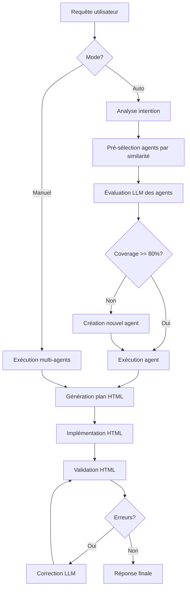
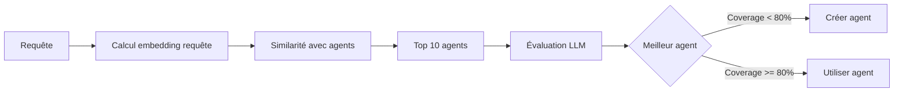
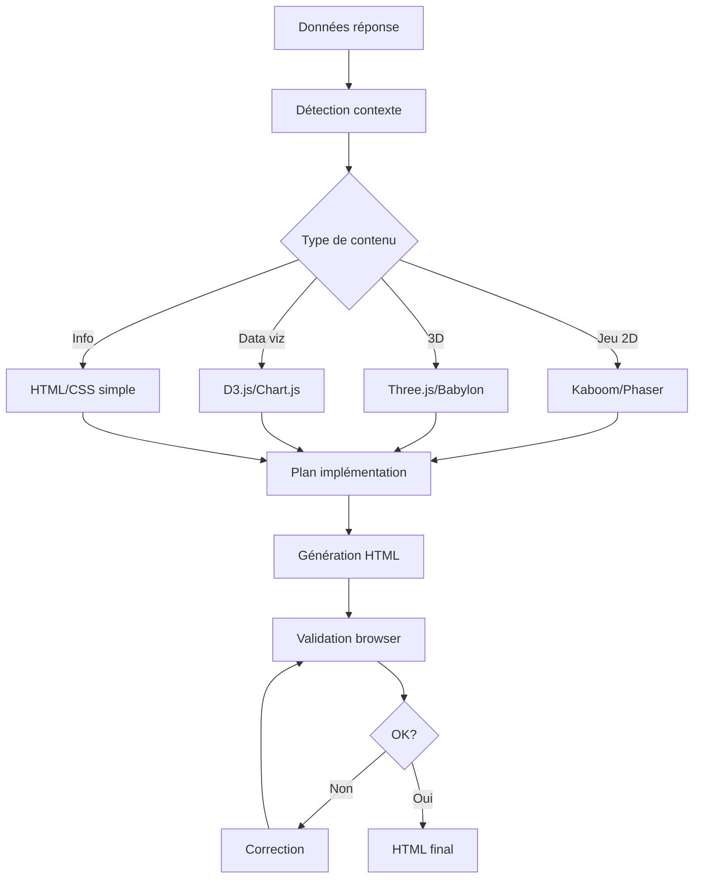

# Meta-Chat Flow Documentation

Ce document détaille le flow complet du système Meta-Chat d'UXMCP, depuis la réception d'une question utilisateur jusqu'à la génération de la réponse finale.

## Table des matières

1. [Vue d'ensemble](#vue-densemble)
2. [Architecture du système](#architecture-du-système)
3. [Flow détaillé étape par étape](#flow-détaillé-étape-par-étape)
4. [Diagrammes de flow](#diagrammes-de-flow)
5. [Détails techniques](#détails-techniques)
6. [Exemples concrets](#exemples-concrets)
7. [Points d'extension](#points-dextension)

## Vue d'ensemble

Le Meta-Chat est un système intelligent de routage et d'orchestration qui :
- Analyse les requêtes utilisateur pour déterminer l'intention
- Sélectionne ou crée automatiquement des agents appropriés
- Orchestre l'exécution des agents avec leurs outils MCP
- Génère des réponses HTML/CSS/JS interactives et validées
- Supporte deux modes : automatique et manuel

### Modes de fonctionnement

1. **Mode Auto** (par défaut) : Le système analyse la requête et sélectionne automatiquement le meilleur agent
2. **Mode Manuel** : L'utilisateur spécifie explicitement quels agents utiliser

## Architecture du système

### Composants principaux

```
┌─────────────────┐     ┌──────────────────┐     ┌─────────────────┐
│   API Endpoint  │────▶│  MetaChatService │────▶│  Agent Executor │
│ /meta-chat/query│     │                  │     │                 │
└─────────────────┘     └──────────────────┘     └─────────────────┘
                               │                           │
                               ▼                           ▼
                        ┌──────────────┐           ┌──────────────┐
                        │ LLM Profiles │           │ MCP Services │
                        └──────────────┘           └──────────────┘
                               │                           │
                               ▼                           ▼
                        ┌──────────────┐           ┌──────────────┐
                        │   Prompts    │           │   Agents DB  │
                        └──────────────┘           └──────────────┘
```

### Classes et services impliqués

- **MetaChatService** : Orchestrateur principal
- **AgentExecutor** : Exécute les agents avec leurs outils
- **HTMLValidator** : Valide et corrige le HTML généré
- **AgentEmbeddingService** : Calcule la similarité sémantique
- **PromptManager** : Gère les prompts LLM

## Flow détaillé étape par étape

### 1. Réception de la requête

**Endpoint**: `POST /meta-chat/query`

```python
# backend/app/api/meta_chat.py
@router.post("/query", response_model=MetaChatResponse)
async def query_meta_chat(request: MetaChatRequest):
    # MetaChatRequest contient:
    # - message: str (la question utilisateur)
    # - llm_profile: str (profil LLM à utiliser)
    # - mode: "auto" | "manual"
    # - selected_agents: List[str] (pour mode manuel)
    # - instruct: str (instructions HTML personnalisées)
```

### 2. Traitement selon le mode

#### Mode Manuel
Si `mode == "manual"` et `selected_agents` fournis :
1. Exécution parallèle des agents sélectionnés
2. Fusion des réponses
3. Génération HTML unifiée

#### Mode Auto (par défaut)
Continue avec l'analyse d'intention...

### 3. Analyse de l'intention (Mode Auto)

**Fonction**: `_analyze_request()`
**Prompt**: `meta_chat/analyze_intent.txt`

```python
# Le prompt analyse la requête et détermine :
# - intent: ce que l'utilisateur veut
# - response_type: "agent" (par défaut) ou "direct"
# - needs_agent: true (par défaut)
# - agent_type: type d'agent nécessaire
# - parameters: paramètres extraits
# - confidence: niveau de confiance
```

Le prompt privilégie fortement l'utilisation d'agents pour :
- Requêtes d'information (actualités, météo)
- Données temps réel
- Actions nécessitant des API externes

### 4. Sélection d'agent

**Fonction**: `_find_suitable_agent()`

Processus en deux étapes :

#### 4.1 Pré-sélection par similarité sémantique
```python
# Utilise AgentEmbeddingService pour :
# 1. Calculer l'embedding de la requête
# 2. Comparer avec les embeddings des agents
# 3. Sélectionner les 10 agents les plus similaires
```

#### 4.2 Évaluation LLM
**Prompt**: `meta_chat/find_suitable_agent.txt`

```python
# Le LLM évalue chaque agent pré-sélectionné sur :
# - coverage: pourcentage de la requête qu'il peut traiter
# - missing_capabilities: ce qui manque
# - confidence: niveau de confiance
# 
# Seuil de coverage : 80% minimum
```

### 5. Création d'agent si nécessaire

Si aucun agent n'a une coverage >= 80% :

**Fonction**: `_create_agent_for_intent()`

1. Utilise le Meta-Agent pour créer un nouvel agent
2. Inclut les capacités manquantes identifiées
3. Crée automatiquement les outils nécessaires
4. Active l'agent immédiatement

### 6. Exécution de l'agent

**Fonction**: `_execute_agent()` → `AgentExecutor.execute()`

```python
# L'exécution comprend :
# 1. Validation du format d'entrée
# 2. Chargement du contexte mémoire (si activé)
# 3. Préparation des outils MCP
# 4. Appel LLM avec outils
# 5. Itérations jusqu'à réponse complète
# 6. Sauvegarde en mémoire
```

### 7. Génération de la réponse HTML

**Fonction**: `_generate_html_response()`

Processus en deux phases :

#### 7.1 Planification
**Prompt**: `meta_chat/html_planning.txt`
```python
# Génère un plan d'implémentation incluant :
# - Structure de la page
# - Bibliothèques à utiliser
# - Design visuel
# - Interactivité requise
```

#### 7.2 Implémentation
**Prompt**: `meta_chat/html_implementation.txt`
```python
# Génère le HTML complet basé sur :
# - Le plan créé
# - Les données de réponse
# - Les instructions personnalisées
```

### 8. Validation et correction HTML

**Service**: `HTMLValidator`

```python
# Validation avec Playwright :
# 1. Charge le HTML dans un navigateur headless
# 2. Détecte les erreurs JS/console
# 3. Vérifie la structure (canvas pour jeux, etc.)
# 4. Si erreurs : demande correction au LLM
# 5. Maximum 3 tentatives de correction
```

### 9. Retour de la réponse

```python
MetaChatResponse(
    success=True,
    agent_used="nom_agent",
    agent_created=bool,
    response_data={...},
    html_response="<html>...",
    metadata={...},
    session_id="uuid"
)
```

## Diagrammes de flow

### Flow principal (Mode Auto)



### Flow de sélection d'agent



### Flow de génération HTML



## Détails techniques

### Modèles de données

#### MetaChatRequest
```python
class MetaChatRequest(BaseModel):
    message: str                          # Question utilisateur
    llm_profile: str                      # Profil LLM
    mode: Literal["auto", "manual"]       # Mode d'exécution
    selected_agents: Optional[List[str]]  # Agents pour mode manuel
    instruct: Optional[str]               # Instructions HTML custom
```

#### ChatIntent
```python
class ChatIntent(BaseModel):
    intent: str                    # Intention détectée
    response_type: ResponseType    # "agent" ou "direct"
    needs_agent: bool             # Besoin d'un agent
    agent_type: Optional[str]     # Type d'agent
    parameters: Dict[str, Any]    # Paramètres extraits
    confidence: float             # Confiance (0-1)
```

### Prompts clés

1. **analyze_intent.txt** : Détermine si un agent est nécessaire
2. **find_suitable_agent.txt** : Évalue la compatibilité des agents
3. **html_planning.txt** : Planifie la structure HTML
4. **html_implementation.txt** : Génère le HTML final

### Mécanisme de sélection d'agents

1. **Embeddings** : Chaque agent a un embedding basé sur sa description
2. **Similarité cosinus** : Compare requête vs agents
3. **Évaluation contextuelle** : LLM évalue la pertinence réelle
4. **Historique d'usage** : Préférence aux agents avec historique pertinent

### Système de mémoire

- **ChromaDB** : Stockage vectoriel des souvenirs
- **MongoDB** : Métadonnées et contexte
- **Outils mémoire** : memory_search, memory_store, memory_analyze
- **TTL** : Mémoire court terme avec expiration

## Exemples concrets

### Exemple 1 : Requête simple (météo)

**Requête** : "Quel temps fait-il à Paris ?"

1. **Analyse** : Intent = météo, agent_type = weather
2. **Sélection** : Agent "weather-service" (coverage 100%)
3. **Exécution** : Appel API météo
4. **HTML** : Page avec icônes météo, température, prévisions
5. **Validation** : OK sans erreur

### Exemple 2 : Requête complexe (multi-besoins)

**Requête** : "Montre-moi la météo et les actualités de Paris"

1. **Analyse** : Intent = multi-info (météo + news)
2. **Sélection** : Aucun agent avec coverage >= 80%
3. **Création** : Nouvel agent "paris_info_agent" avec outils météo + news
4. **Exécution** : Appels parallèles aux APIs
5. **HTML** : Dashboard avec 2 sections
6. **Validation** : Correction d'une erreur JS

### Exemple 3 : Mode manuel

**Requête** : "Compare les prévisions" avec agents ["meteo-simple", "weather2.0"]

1. **Mode manuel** : Skip analyse
2. **Exécution parallèle** : 2 agents simultanés
3. **Fusion** : Réponses combinées
4. **HTML** : Tableau comparatif
5. **Validation** : OK

## Points d'extension

### Ajouter un nouveau type d'analyse

1. Créer un nouveau prompt dans `prompts/meta_chat/`
2. Étendre `ChatIntent` si nécessaire
3. Modifier `_analyze_request()` pour le nouveau type

### Personnaliser la sélection d'agents

1. Modifier les poids de similarité dans `AgentEmbeddingService`
2. Ajuster le seuil de coverage (80% par défaut)
3. Ajouter des critères dans `find_suitable_agent.txt`

### Étendre la validation HTML

1. Ajouter des tests dans `HTMLValidator.test_html()`
2. Créer des règles spécifiques par type de contenu
3. Personnaliser les prompts de correction

### Optimisations possibles

1. **Cache** : Mettre en cache les embeddings d'agents
2. **Parallélisation** : Exécuter analyse et pré-sélection en parallèle
3. **Streaming** : Retourner la réponse HTML en streaming
4. **Métriques** : Tracker les performances par type de requête

## Conclusion

Le système Meta-Chat offre une architecture flexible et extensible pour :
- Router intelligemment les requêtes vers les bons agents
- Créer automatiquement des agents manquants
- Générer des visualisations HTML riches et validées
- S'améliorer continuellement via le système de mémoire

Les points clés sont :
- Préférence forte pour l'utilisation d'agents
- Sélection hybride (embeddings + LLM)
- Génération HTML en deux phases avec validation
- Support du mode manuel pour contrôle explicite